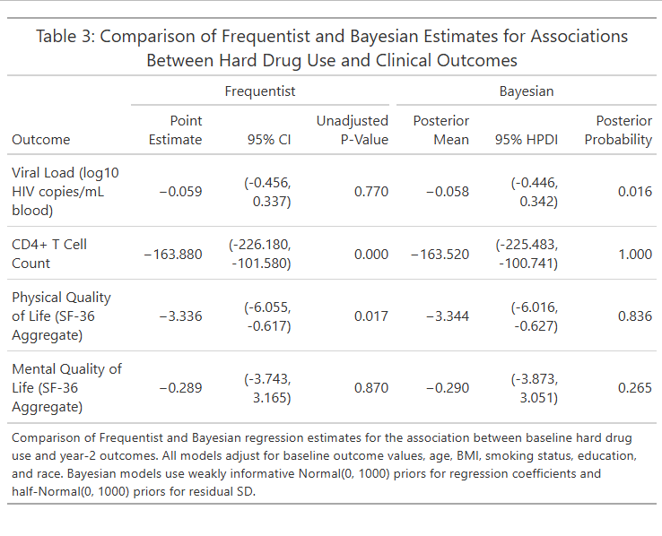
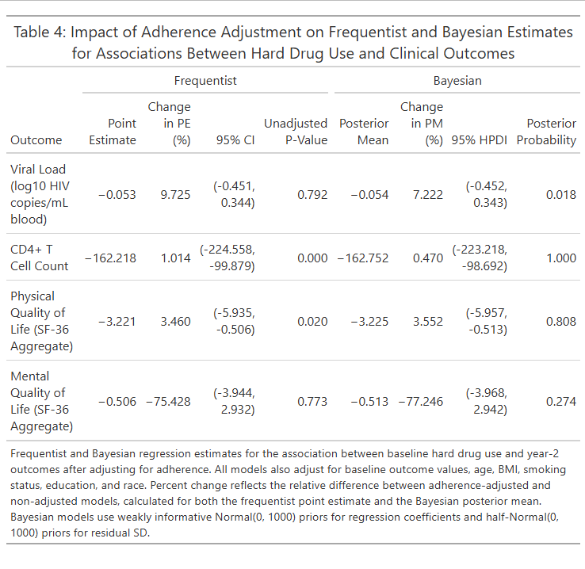
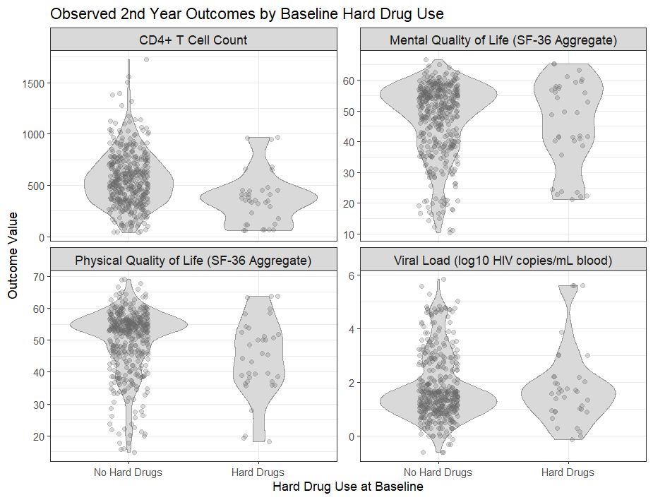

---
output:
  bookdown::pdf_document2:
    toc: false
    number_sections: false
documentclass: article
geometry: margin=1in
fontsize: 12pt
linestretch: 2
fig.cap: true
header-includes:
  - \usepackage{float}
editor_options: 
  chunk_output_type: inline
---

```{r setup, include=FALSE}
knitr::opts_chunk$set(echo = TRUE)
library(dplyr)
library(tidyr)
library(tidyverse)
library(purrr)
library(ggplot2)
library(table1)
library(Hmisc)
library(cmdstanr)
library(posterior)
library(tidybayes)
library(tibble)
library(mcmcse)
library(gt)
library(scales)
library(bayesplot)
dat_raw <- read.csv(here::here("P1/DataRaw", "hiv_6624_final.csv"))
```

<!-- Title here: -->
# \textit{Associations Between Baseline Hard Drug Use and Two-Year Treatment Outcomes After HAART Initiation}

<!-- Name here: -->
Ezra Weible[^1]

[^1]: Biostatistics Masters Student, Colorado School of Public Health, CU Anschutz Medical Campus

```{r data_management, echo=FALSE, message=FALSE, results='hide', warning=FALSE, cache=TRUE}
dat_sub <- dat_raw %>%
  filter(
    years %in% c(0, 2)
  ) %>%
    # Filter to baseline and year 2
  mutate(
    race_group = case_when(
      RACE == 1 ~ "White, non-Hispanic",
      RACE %in% 2:8 ~ "Other",
      TRUE ~ NA_character_
    ), # Collapse race
    educ_group = case_when(
      EDUCBAS %in% 1:4 ~ "No College Degree",
      EDUCBAS %in% 5:7 ~ "College Degree and above",
      TRUE ~ NA_character_
    ), # Collapse education
    smoke_group = case_when(
      SMOKE %in% c(1, 2) ~ "Non or Former Smoker",
      SMOKE == 3 ~ "Current Smoker",
      TRUE ~ NA_character_
    ), # Collapse smoking status
    adh_group = case_when(
      ADH %in% c(1, 2) ~ "95% and Above",
      ADH %in% c(3, 4) ~ "<95%",
      TRUE ~ NA_character_
    ), # Collapse adherence 
    hard_drugs = case_when(
      hard_drugs == 0 ~ "No",
      hard_drugs == 1 ~ "Yes",
      TRUE ~ NA_character_
    ),
      # Add labels to hard drugs
    BMI = if_else(
      BMI < 0 | BMI > 250, NA_real_, BMI
    ), # Exclude implausible BMI values
    log10VLOAD = log10(VLOAD)
      # Convert VLOAD to log10 scale
  ) %>%
  mutate(
    smoke_group = factor(smoke_group, 
                         levels = c("Non or Former Smoker", "Current Smoker")), 
    educ_group = factor(educ_group, 
                        levels = c("No College Degree", "College Degree and above")), 
    race_group = factor(race_group, 
                        levels = c("White, non-Hispanic", "Other")), 
    adh_group = factor(adh_group, 
                       levels = c("95% and Above", "<95%")), 
    hard_drugs = factor(hard_drugs, 
                        levels = c("No", "Yes"))
  ) # Reorder groups

dat_wide <- dat_sub %>%
  pivot_wider(
    id_cols = newid,
    names_from = years,
    values_from = c(
      log10VLOAD, LEU3N, AGG_PHYS, AGG_MENT,
      age, BMI, smoke_group, educ_group, race_group,
      hard_drugs, adh_group
    ),
    names_glue = "{.value}_{years}"
  ) # Pivot to wide

required_outcomes <- c("log10VLOAD_0", "log10VLOAD_2", "LEU3N_0", "LEU3N_2",
                       "AGG_PHYS_0", "AGG_PHYS_2", "AGG_MENT_0", "AGG_MENT_2")
  # Store required outcomes
required_predictors <- c("age_0", "BMI_0", "smoke_group_0", "educ_group_0",
                         "race_group_0", "hard_drugs_0", "adh_group_2")
  # Store required predictors

dat_wide <- dat_wide %>%
  filter(
    complete.cases(across(c(required_outcomes, required_predictors)))
  ) %>% # Filter to those without missing outcomes or predictors
  select(
    newid, all_of(required_outcomes), all_of(required_predictors)
  ) # Only select relevant columns
      # 463 final sample size

dat_tab <- dat_wide
label(dat_tab$log10VLOAD_0) <- "Viral Load (log10 HIV copies/mL blood)"
label(dat_tab$LEU3N_0) <- "CD4+ T Cell Count"
label(dat_tab$AGG_PHYS_0) <- "Physical Quality of Life (SF-36 Aggregate)"
label(dat_tab$AGG_MENT_0) <- "Mental Quality of Life (SF-36 Aggregate)"
label(dat_tab$age_0) <- "Age (years)"
label(dat_tab$BMI_0) <- "BMI (kg/m^2)"
label(dat_tab$smoke_group_0) <- "Smoking Status"
label(dat_tab$educ_group_0) <- "Education Status"
label(dat_tab$race_group_0) <- "Race/Ethnicity"
label(dat_tab$log10VLOAD_2) <- "Viral Load (log10 HIV copies/mL blood)"
label(dat_tab$LEU3N_2) <- "CD4+ T Cell Count"
label(dat_tab$AGG_PHYS_2) <- "Physical Quality of Life (SF-36 Aggregate)"
label(dat_tab$AGG_MENT_2) <- "Mental Quality of Life (SF-36 Aggregate)"
label(dat_tab$adh_group_2) <- "Adherence to HAART since Last Visit"
  # Add labels for table 1

table1 <- table1(~ log10VLOAD_0 + LEU3N_0 + AGG_PHYS_0 + AGG_MENT_0 + age_0 + 
                   BMI_0 + smoke_group_0 + educ_group_0 + race_group_0 | 
                   hard_drugs_0, dat_tab,
                   caption="Baseline Characteristics by Baseline Hard Drug Use")
  # Generate table 1 (baseline)
table2 <- table1(~ log10VLOAD_2 + LEU3N_2 + AGG_PHYS_2 + AGG_MENT_2 + 
                   adh_group_2 | hard_drugs_0, dat_tab, 
                 caption="Year 2 Characteristics by Baseline Hard Drug Use")
  # Generate table 2 (year 2)

## Examine outcome distributions
var_specs <- tibble(
  variable = c("VLOAD", "LEU3N", "AGG_PHYS", "AGG_MENT"),
  label = c("Viral Load (log10)", 
            "CD4 Count", 
            "Physical Quality of Life", 
            "Mental Quality of Life"),
  binwidth = c(0.5, 100, 5, 5)
) # Custom labels and widths

df_long <- dat_sub %>%
  filter(years == 2) %>%
    # Filter to year 2
  mutate(VLOAD = log10(VLOAD)) %>%
    # log10 transformation
  pivot_longer(
    cols = c(VLOAD, LEU3N, AGG_PHYS, AGG_MENT),
    names_to = "variable",
    values_to = "value"
  ) %>% # Pivot data
  left_join(var_specs, by = "variable") %>%
  mutate(label = factor(label, levels = var_specs$label))
    # Add custom info
ggplot() +
  imap(split(df_long, df_long$label), ~
    geom_histogram(
      data = .x,
      aes(x = value),
      binwidth = .x$binwidth[1],
      color = "white",
      fill = "steelblue"
    )) + # Allow for addition of custom info
  facet_wrap(~ label, scales = "free") +
    # Split to panels
  theme_minimal() +
  labs(
    x = "",
    y = "Count",
    title = "Distributions of Year 2 Outcomes"
  )
```
```{r frequentist, echo=FALSE, results='hide', message=FALSE, warning=FALSE, cache=TRUE}
## Frequentist models
mod_vload <- lm(log10VLOAD_2 ~ hard_drugs_0 + log10VLOAD_0 + age_0 + BMI_0 +
                  smoke_group_0 + educ_group_0 + race_group_0, data = dat_wide)
mod_cd4 <- lm(LEU3N_2 ~ hard_drugs_0 + LEU3N_0 + age_0 + BMI_0 + smoke_group_0 +
                educ_group_0 + race_group_0, data = dat_wide)
mod_phys <- lm(AGG_PHYS_2 ~ hard_drugs_0 + AGG_PHYS_0 + age_0 + BMI_0 +
                 smoke_group_0 + educ_group_0 + race_group_0, data = dat_wide)
mod_ment <- lm(AGG_MENT_2 ~ hard_drugs_0 + AGG_MENT_0 + age_0 + BMI_0 +
                 smoke_group_0 + educ_group_0 + race_group_0, data = dat_wide)

## Frequentist models with adherence
mod_vload_adh <- lm(log10VLOAD_2 ~ hard_drugs_0 + log10VLOAD_0 + age_0 + BMI_0 +
                      smoke_group_0 + educ_group_0 + race_group_0 + adh_group_2,
                    data = dat_wide)
mod_cd4_adh <- lm(LEU3N_2 ~ hard_drugs_0 + LEU3N_0 + age_0 + BMI_0 + 
                    smoke_group_0 + educ_group_0 + race_group_0 + adh_group_2,
                  data = dat_wide)
mod_phys_adh <- lm(AGG_PHYS_2 ~ hard_drugs_0 + AGG_PHYS_0 + age_0 + BMI_0 +
                     smoke_group_0 + educ_group_0 + race_group_0 + adh_group_2,
                   data = dat_wide)
mod_ment_adh <- lm(AGG_MENT_2 ~ hard_drugs_0 + AGG_MENT_0 + age_0 + BMI_0 +
                     smoke_group_0 + educ_group_0 + race_group_0 + adh_group_2,
                   data = dat_wide)

## View model outputs
summary(mod_vload)
summary(mod_vload_adh)
summary(mod_cd4)
summary(mod_cd4_adh)
summary(mod_phys)
summary(mod_phys_adh)
summary(mod_ment)
summary(mod_ment_adh)
```
```{r freq_tables, echo=FALSE, message=FALSE, results='hide', warning=FALSE, cache=TRUE}
summarize_lm_beta2 <- function(mod) { # Function to extract frequentist output
  sm <- summary(mod)
    # Full model summary
  coefs <- sm$coefficients
    # Coefficients table
  est <- coefs["hard_drugs_0Yes", "Estimate"]
    # Pull point estimate
  se  <- coefs["hard_drugs_0Yes", "Std. Error"]
    # Pull standard error
  p   <- coefs["hard_drugs_0Yes", "Pr(>|t|)"]
    # Pull p-value
  ci_low  <- est - 1.96 * se
  ci_high <- est + 1.96 * se
    # Calculate 95% CI
  
  tibble(
    Parameter = "hard_drugs_0Yes",
    PE = est,
    CI_2.5 = ci_low,
    CI_97.5 = ci_high,
    p_value = p
  ) # Return results as a tibble
}

mod_list <- list(
  `Viral Load (log10 HIV copies/mL blood)` = mod_vload,
  `Viral Load (log10 HIV copies/mL blood)_adh` = mod_vload_adh,
  `CD4+ T Cell Count` = mod_cd4,
  `CD4+ T Cell Count_adh` = mod_cd4_adh,
  `Physical Quality of Life (SF-36 Aggregate)` = mod_phys,
  `Physical Quality of Life (SF-36 Aggregate)_adh` = mod_phys_adh,
  `Mental Quality of Life (SF-36 Aggregate)` = mod_ment,
  `Mental Quality of Life (SF-36 Aggregate)_adh` = mod_ment_adh
) # List of frequentist models, renamed for tables

tab_freq <- purrr::map_df(mod_list, summarize_lm_beta2, .id = "Model") %>%
    # Apply function to each model
  mutate(
    CI = sprintf("(%0.3f, %0.3f)", CI_2.5, CI_97.5)
  ) %>% # Combine CIs and limit to 3 decimal places
  select(Outcome = Model, `Point Estimate` = PE, `95% CI` = CI, `Unadjusted P-Value` = p_value)
    # Select and rename final columns

tab_freq_adh <- purrr::map_df(mod_list, summarize_lm_beta2, .id = "Model") %>%
    # Apply function to each model
  mutate(
    Outcome = sub("_adh$", "", Model),
    adh = grepl("_adh$", Model),
      # Select only results from adherence models
    CI = sprintf("(%0.3f, %0.3f)", CI_2.5, CI_97.5)
      # Combine CIs and limit to 3 decimal places
  ) %>%
  select(Outcome, adh, PE, CI, p_value) %>%
    # Select relevant columns
  pivot_wider(
    names_from = adh,
    values_from = c(PE, CI, p_value),
    names_prefix = "",
    names_sep = "_"
  ) %>% # Pivot to wide and add subscript to note adh
  rename(
    PE = PE_FALSE, 
    PE_adh = PE_TRUE, 
    CI = CI_FALSE, 
    CI_adh = CI_TRUE, 
    p_value = p_value_FALSE, 
    p_value_adh = p_value_TRUE
  ) %>% # Rename columns 
  mutate(
    Percent_Change = 100 * (PE_adh - PE) / abs(PE)
  ) %>% # Calculate impact of adherence
  select(Outcome, `Point Estimate` = PE_adh, `Change in PE (%)` = Percent_Change, `95% CI` = CI_adh, `Unadjusted P-Value` = p_value_adh)
    # Select and rename final columns
```
```{r stan_setup, echo=FALSE, message=FALSE, results='hide', warning=FALSE, cache=TRUE}
## Set up STAN - only run one time, then comment out

# # Dependencies
# library(cmdstanr)
# library(bayesplot)  # diagnostic plots of the MCMC chains
# library(posterior)  # for summarizing posterior draws
# library(bayestestR) # for calculating higest density posterior intervals
# library(mcmcse)     # for calculating MCMCSE's
# library(loo)        # for getting model fit statistics (WAIC and LOO-IC)
# library(dplyr)
# library(tibble)
# 
# ####Bayesian Analysis
# ###########################################################################
# # STEP 1: Define the model
# # This is a general linear regression set up for STAN
# # It is using a half normal prior on sigma
# # and normal priors on the regression coefficients
# # once the stan file is written it can be reused
# 
# # Do not need to rerun after initial. Works for any
# # linear regression you would like to do. Uses half normal
# # Saves program in correct file format in STAN
# ###########################################################################
# 
# stan_file <- write_stan_file("data {
#   int<lower=0> N;                  // number of observations
#   int<lower=0> P;                  // number of predictors including intercept
#   matrix[N, P] X;                  // design matrix (first column = intercept)
#   vector[N] y;                     // outcome
# 
#   vector[P] prior_mean;            // prior means for each beta
#   vector<lower=0>[P] prior_sd;     // prior SDs for each beta
# 
#   real<lower=0> sigma_prior_sd;    // SD for half-normal prior on sigma
# }
# 
# parameters {
#   vector[P] beta;                  // regression coefficients
#   real<lower=0> sigma;             // residual SD
# }
# 
# model {
#   // Vectorized priors for regression coefficients
#   beta ~ normal(prior_mean, prior_sd);
# 
#   // Half-normal prior for sigma
#   sigma ~ normal(0, sigma_prior_sd);
# 
#   // Likelihood
#   y ~ normal(X * beta, sigma);
# 
# 
# }
# 
# generated quantities {
#   // log likelihood for each observation for calculating model fit stats
#   vector[N] log_lik;
#   for (n in 1:N) {
#     log_lik[n] = normal_lpdf(y[n] | X[n] * beta, sigma);}
#   }", dir="STAN", basename='linear_regression_half_normal'
# )
# 
# ###########################################################################
# # STEP 2: Compile the Stan program
# ###########################################################################
mod <- cmdstan_model('STAN/linear_regression_half_normal.stan')
```
```{r bayes_setup, echo=FALSE, message=FALSE, results='hide', warning=FALSE, cache=TRUE}
# Outcome
y1 <- dat_wide$log10VLOAD_2
y2 <- dat_wide$LEU3N_2
y3 <- dat_wide$AGG_PHYS_2
y4 <- dat_wide$AGG_MENT_2


# Design matrix
X1a <- model.matrix(~ hard_drugs_0 + log10VLOAD_0 + age_0 + BMI_0 +
                    smoke_group_0 + educ_group_0 + race_group_0, data = dat_wide)
X1b <- model.matrix(~ hard_drugs_0 + log10VLOAD_0 + age_0 + BMI_0 +
                    smoke_group_0 + educ_group_0 + race_group_0 + adh_group_2,
                   data = dat_wide)
X2a <- model.matrix(~ hard_drugs_0 + LEU3N_0 + age_0 + BMI_0 +
                    smoke_group_0 + educ_group_0 + race_group_0, data = dat_wide)
X2b <- model.matrix(~ hard_drugs_0 + LEU3N_0 + age_0 + BMI_0 +
                    smoke_group_0 + educ_group_0 + race_group_0 + adh_group_2,
                   data = dat_wide)
X3a <- model.matrix(~ hard_drugs_0 + AGG_PHYS_0 + age_0 + BMI_0 +
                    smoke_group_0 + educ_group_0 + race_group_0, data = dat_wide)
X3b <- model.matrix(~ hard_drugs_0 + AGG_PHYS_0 + age_0 + BMI_0 +
                    smoke_group_0 + educ_group_0 + race_group_0 + adh_group_2,
                   data = dat_wide)
X4a <- model.matrix(~ hard_drugs_0 + AGG_MENT_0 + age_0 + BMI_0 +
                    smoke_group_0 + educ_group_0 + race_group_0, data = dat_wide)
X4b <- model.matrix(~ hard_drugs_0 + AGG_MENT_0 + age_0 + BMI_0 +
                    smoke_group_0 + educ_group_0 + race_group_0 + adh_group_2,
                   data = dat_wide)

# Sizes
N1a <- nrow(X1a)
P1a <- ncol(X1a)
N1b <- nrow(X1b)
P1b <- ncol(X1b)
N2a <- nrow(X2a)
P2a <- ncol(X2a)
N2b <- nrow(X2b)
P2b <- ncol(X2b)
N3a <- nrow(X3a)
P3a <- ncol(X3a)
N3b <- nrow(X3b)
P3b <- ncol(X3b)
N4a <- nrow(X4a)
P4a <- ncol(X4a)
N4b <- nrow(X4b)
P4b <- ncol(X4b)

# Priors: Normal(0, 1000) for all betas, Half-normal(0, 1000) for sigma
prior_mean_1a <- rep(0, P1a); prior_sd_1a   <- rep(1000, P1a)
prior_mean_1b <- rep(0, P1b); prior_sd_1b   <- rep(1000, P1b)
prior_mean_2a <- rep(0, P2a); prior_sd_2a   <- rep(1000, P2a)
prior_mean_2b <- rep(0, P2b); prior_sd_2b   <- rep(1000, P2b)
prior_mean_3a <- rep(0, P3a); prior_sd_3a   <- rep(1000, P3a)
prior_mean_3b <- rep(0, P3b); prior_sd_3b   <- rep(1000, P3b)
prior_mean_4a <- rep(0, P4a); prior_sd_4a   <- rep(1000, P4a)
prior_mean_4b <- rep(0, P4b); prior_sd_4b   <- rep(1000, P4b)
sigma_prior_sd <- 1000

# Set up datalists for each model
data_list_1a <- list(
  N = N1a, P = P1a, X = X1a, y = y1,
  prior_mean = prior_mean_1a,
  prior_sd = prior_sd_1a,
  sigma_prior_sd = sigma_prior_sd
)
data_list_1b <- list(
  N = N1b, P = P1b, X = X1b, y = y1,
  prior_mean = prior_mean_1b,
  prior_sd = prior_sd_1b,
  sigma_prior_sd = sigma_prior_sd
)
data_list_2a <- list(
  N = N2a, P = P2a, X = X2a, y = y2,
  prior_mean = prior_mean_2a,
  prior_sd = prior_sd_2a,
  sigma_prior_sd = sigma_prior_sd
)
data_list_2b <- list(
  N = N2b, P = P2b, X = X2b, y = y2,
  prior_mean = prior_mean_2b,
  prior_sd = prior_sd_2b,
  sigma_prior_sd = sigma_prior_sd
)
data_list_3a <- list(
  N = N3a, P = P3a, X = X3a, y = y3,
  prior_mean = prior_mean_3a,
  prior_sd = prior_sd_3a,
  sigma_prior_sd = sigma_prior_sd
)
data_list_3b <- list(
  N = N3b, P = P3b, X = X3b, y = y3,
  prior_mean = prior_mean_3b,
  prior_sd = prior_sd_3b,
  sigma_prior_sd = sigma_prior_sd
)
data_list_4a <- list(
  N = N4a, P = P4a, X = X4a, y = y4,
  prior_mean = prior_mean_4a,
  prior_sd = prior_sd_4a,
  sigma_prior_sd = sigma_prior_sd
)
data_list_4b <- list(
  N = N4b, P = P4b, X = X4b, y = y4,
  prior_mean = prior_mean_4b,
  prior_sd = prior_sd_4b,
  sigma_prior_sd = sigma_prior_sd
)
```
```{r bayesian, echo=FALSE, message=FALSE, results='hide', warning=FALSE, cache=TRUE}
## Bayesian models
fit_vload <- mod$sample(data = data_list_1a, chains = 4, iter_warmup = 2000, iter_sampling = 5000, seed = 123)
fit_cd4 <- mod$sample(data = data_list_2a, chains = 4, iter_warmup = 2000, iter_sampling = 5000, seed = 123)
fit_phys <- mod$sample(data = data_list_3a, chains = 4, iter_warmup = 2000, iter_sampling = 5000, seed = 123)
fit_ment <- mod$sample(data = data_list_4a, chains = 4, iter_warmup = 2000, iter_sampling = 5000, seed = 123)

## Bayesian models with adherence
fit_vload_adh <- mod$sample(data = data_list_1b, chains = 4, iter_warmup = 2000, iter_sampling = 5000, seed = 123)
fit_cd4_adh <- mod$sample(data = data_list_2b, chains = 4, iter_warmup = 2000, iter_sampling = 5000, seed = 123)
fit_phys_adh <- mod$sample(data = data_list_3b, chains = 4, iter_warmup = 2000, iter_sampling = 5000, seed = 123)
fit_ment_adh <- mod$sample(data = data_list_4b, chains = 4, iter_warmup = 2000, iter_sampling = 5000, seed = 123)

## View model outputs
fit_vload
fit_vload_adh
fit_cd4
fit_cd4_adh
fit_phys
fit_phys_adh
fit_ment
fit_ment_adh
```
```{r bayes_diagnostics, echo=FALSE, message=FALSE, results='hide', warning=FALSE, cache=TRUE}
diagnose_model <- function(fit, params, model_name = "model") { # MCMC Diagnostics
  message("\n Diagnostics for: ", model_name)
  
  # Extract draws
  draws      <- as_draws_array(fit$draws())
  draws_df   <- as_draws_df(fit$draws())

  print(
    mcmc_trace(draws, pars = params) +
      ggtitle(paste("Trace Plots —", model_name))
  ) # Trace plots
  
  message("\nSummary statistics (R-hat, ESS):")
  print(fit$summary(variables = params))
    # R hat and ESS
  
  print(
    mcmc_dens_overlay(draws, pars = params) +
      ggtitle(paste("Posterior Densities —", model_name))
  ) # Posterior density plots
  print(
    mcmc_acf(draws, pars = params) +
      ggtitle(paste("Autocorrelation —", model_name))
  ) # Autocorrelation plots
  invisible(NULL)
}

models <- list(
  vload = fit_vload,
  cd4 = fit_cd4,
  phys = fit_phys,
  ment = fit_ment
) # Primary models for all parameters
params <- c("beta[1]", "beta[2]", "beta[3]", "beta[4]", "beta[5]", "beta[6]", "beta[7]", "beta[8]", "sigma")
for (m in names(models)) {
  diagnose_model(models[[m]], params, model_name = m)
} # Run for primary models for all parameters
models <- list(
  vload_adh  = fit_vload_adh,
  cd4_adh = fit_cd4_adh,
  phys_adh = fit_phys_adh,
  ment_adh = fit_ment_adh
) # Adherence models
params <- c("beta[1]", "beta[2]", "beta[3]", "beta[4]", "beta[5]", "beta[6]", "beta[7]", "beta[8]", "beta[9]", "sigma")
for (m in names(models)) {
  diagnose_model(models[[m]], params, model_name = m)
} # Run for adherence models for all parameters
```
```{r bayes_tables, echo=FALSE, message=FALSE, results='hide', warning=FALSE, cache=TRUE}
summarize_stan_beta2 <- function(fit, threshold) { # Function to extract Bayesian output
  draws <- fit$draws()
    # Extract full posterior draws
  draws_mat <- as_draws_matrix(draws)
    # Convert draws to matrix form for indexing
  vals <- as.numeric(draws_mat[, "beta[2]"])
    # Pull posterior samples  
  hpd <- hdi(vals, ci = 0.95)
    # Calculate HPDI
  
  tibble(
    Parameter = "beta[2]",
    PM = mean(vals),
    HPDI_2.5 = hpd[1],
    HPDI_97.5 = hpd[2],
    PP = mean(abs(vals) > threshold)
      # Calcualte posterior probability based on clinically meaningful thresholds
  ) # Return results as a tibble
}

model_list <- list(
  `Viral Load (log10 HIV copies/mL blood)` = fit_vload,
  `Viral Load (log10 HIV copies/mL blood)_adh` = fit_vload_adh,
  `CD4+ T Cell Count` = fit_cd4,
  `CD4+ T Cell Count_adh` = fit_cd4_adh,
  `Physical Quality of Life (SF-36 Aggregate)` = fit_phys,
  `Physical Quality of Life (SF-36 Aggregate)_adh` = fit_phys_adh,
  `Mental Quality of Life (SF-36 Aggregate)` = fit_ment,
  `Mental Quality of Life (SF-36 Aggregate)_adh` = fit_ment_adh
) # List of Bayesian models, renamed for tables

thresholds <- c(0.5, 0.5, 50, 50, 2, 2, 2, 2)
  # Clinically meaningful thresholds

tab_bayes <- purrr::map2_df(model_list, thresholds, summarize_stan_beta2, .id = "Model") %>%
    # Apply function to each model
  mutate(
    HPDI = sprintf("(%0.3f, %0.3f)", HPDI_2.5, HPDI_97.5)
  ) %>% # Combine HPDIs and limit to 3 decimal places
  select(Outcome = Model, `Posterior Mean` = PM, `95% HPDI` = HPDI, `Posterior Probability` = PP)
    # Select and rename final columns

tab_bayes_adh <- purrr::map2_df(model_list, thresholds, summarize_stan_beta2, .id = "Model") %>%
    # Apply function to each model
  mutate(
    Outcome = sub("_adh$", "", Model),
    adh     = grepl("_adh$", Model),
      # Select only results from adherence models
    HPDI    = sprintf("(%0.3f, %0.3f)", HPDI_2.5, HPDI_97.5)
      # Combine HPDIs and limit to 3 decimal places
  ) %>%
  select(Outcome, adh, PM, HPDI, PP) %>%
    # Select relevant columns
  pivot_wider(
    names_from  = adh,
    values_from = c(PM, HPDI, PP)
  ) %>% # Pivot to wide and add subscript to note adh 
  rename(
    PM        = PM_FALSE,
    PM_adh    = PM_TRUE,
    HPDI      = HPDI_FALSE,
    HPDI_adh  = HPDI_TRUE,
    PP        = PP_FALSE,
    PP_adh    = PP_TRUE
  ) %>% # Rename columns 
  mutate(
    Percent_Change = 100 * (PM_adh - PM) / abs(PM)
  ) %>% # Calculate impact of adherence
  select(Outcome, `Posterior Mean` = PM_adh, `Change in PM (%)` = Percent_Change, `95% HPDI` = HPDI_adh, `Posterior Probability` = PP_adh)
    # Select and rename final columns
```
```{r comb_tables, echo=FALSE, message=FALSE, results='hide', warning=FALSE, cache = TRUE}
tab_comb <- dplyr::left_join(tab_freq, tab_bayes, by = "Outcome") %>%
    # Combine two tables
  filter(!grepl("_adh$", Outcome)) %>%
    # Filter to models without adherence
  gt() %>%
    # Convert to gt table
  tab_spanner(
    label = "Frequentist",
    columns = c(`Point Estimate`, `95% CI`, `Unadjusted P-Value`)
  ) %>% # Add Frequentist label
  tab_spanner(
    label = "Bayesian",
    columns = c(`Posterior Mean`, `95% HPDI`, `Posterior Probability`)
  ) %>% # Add Bayesian label
  fmt_number(
    columns = c(`Point Estimate`, `Unadjusted P-Value`, `Posterior Mean`, `Posterior Probability`),
    decimals = 3
  ) %>% # Round estimates
  tab_header(
    title = "Table 3: Comparison of Frequentist and Bayesian Estimates for Associations Between Hard Drug Use and Clinical Outcomes"
  ) %>% 
  tab_footnote(
    footnote = "Comparison of Frequentist and Bayesian regression estimates for the association between baseline hard drug use and year-2 outcomes. All models adjust for baseline outcome values, age, BMI, smoking status, education, and race. Bayesian models use weakly informative Normal(0, 1000) priors for regression coefficients and half-Normal(0, 1000) priors for residual SD." 
  )

tab_adh <- dplyr::left_join(tab_freq_adh, tab_bayes_adh, by = "Outcome") %>%
    # Combine two tables
  gt() %>%
    # Convert to gt table
  tab_spanner(
    label = "Frequentist",
    columns = c(`Point Estimate`, `Change in PE (%)`, `95% CI`, `Unadjusted P-Value`)
  ) %>% # Add Frequentist label
  tab_spanner(
    label = "Bayesian",
    columns = c(`Posterior Mean`, `Change in PM (%)`, `95% HPDI`, `Posterior Probability`)
  ) %>% # Add Bayesian label
  fmt_number(
    columns = c(`Point Estimate`, `Change in PE (%)`, `Unadjusted P-Value`, `Posterior Mean`, `Change in PM (%)`, `Posterior Probability`),
    decimals = 3
  ) %>% # Round estimates
  tab_header(
    title = "Table 4: Impact of Adherence Adjustment on Frequentist and Bayesian Estimates for Associations Between Hard Drug Use and Clinical Outcomes"
  ) %>%
  tab_footnote(
    footnote = "Frequentist and Bayesian regression estimates for the association between baseline hard drug use and year-2 outcomes after adjusting for adherence. All models also adjust for baseline outcome values, age, BMI, smoking status, education, and race. Percent change reflects the relative difference between adherence-adjusted and non-adjusted models, calculated for both the frequentist point estimate and the Bayesian posterior mean. Bayesian models use weakly informative Normal(0, 1000) priors for regression coefficients and half-Normal(0, 1000) priors for residual SD." 
  )
```
```{r fig_raw, echo=FALSE, message=FALSE, results='hide', warning=FALSE, cache=TRUE}
dat_plot <- dat_wide %>%
  select(
    hard_drugs_0,
    log10VLOAD_2,
    LEU3N_2,
    AGG_PHYS_2,
    AGG_MENT_2
  ) %>% # Select outcomes and drugs
  pivot_longer(
    cols = -hard_drugs_0,
    names_to = "Outcome",
    values_to = "Value"
  ) %>% # Pivot to long
  mutate(
    hard_drugs_0 = factor(hard_drugs_0, labels = c("No Hard Drugs", "Hard Drugs")),
    Outcome = recode(
      Outcome,
      log10VLOAD_2 = "Viral Load (log10 HIV copies/mL blood)",
      LEU3N_2 = "CD4+ T Cell Count",
      AGG_PHYS_2 = "Physical Quality of Life (SF-36 Aggregate)",
      AGG_MENT_2 = "Mental Quality of Life (SF-36 Aggregate)"
    )
  ) # Rename for figure

fig1 <- ggplot(dat_plot, aes(x = hard_drugs_0, y = Value)) +
    # Plot outcomes by baseline hard drug use
  geom_violin(fill = "gray85", color = "gray60") +
    # Raw data as violin
  geom_jitter(alpha = 0.25, width = 0.15, color = "gray40") +
    # Violin transparent
  facet_wrap(~ Outcome, scales = "free_y") +
    # Facet by outcome
  labs(
    x = "Hard Drug Use at Baseline",
    y = "Outcome Value",
    title = "Observed 2nd Year Outcomes by Baseline Hard Drug Use"
  ) +
  theme_bw() +
  theme(
    strip.text = element_text(size = 11),
    legend.position = "none"
  )
```
```{r fig_models, echo=FALSE, message=FALSE, results='hide', warning=FALSE, cache=TRUE}
forest_df <-
  purrr::map_df(mod_list, summarize_lm_beta2, .id = "Model") %>%
    # Frequentist
  mutate(
    Adjustment = ifelse(grepl("_adh$", Model), "With Adherence", "Unadjusted"),
    Outcome = sub("_adh$", "", Model),
    Method = "Frequentist"
  ) %>% # Add labels 
  transmute(
    Outcome,
    Method,
    Adjustment,
    Estimate = PE,
    lower = CI_2.5,
    upper = CI_97.5
  ) %>% # Rename 
  
  bind_rows(
    purrr::map2_df(model_list, thresholds, summarize_stan_beta2, .id = "Model") %>%
        # Bayesian
      mutate(
        Adjustment = ifelse(grepl("_adh$", Model), "With Adherence", "Unadjusted"),
        Outcome = sub("_adh$", "", Model),
        Method = "Bayesian"
      ) %>% # Add labels
      transmute(
        Outcome,
        Method,
        Adjustment,
        Estimate = PM,
        lower = HPDI_2.5,
        upper = HPDI_97.5
      ) # Rename
  ) %>% # Add Bayesian outcomes
  
  mutate(
    Outcome = recode(
      Outcome,
      log10VLOAD_2 = "Viral Load (log10 HIV copies/mL blood)",
      LEU3N_2      = "CD4+ T Cell Count",
      AGG_PHYS_2   = "Physical Quality of Life (SF-36 Aggregate)",
      AGG_MENT_2   = "Mental Quality of Life (SF-36 Aggregate)"
    ), # Rename outcomes
    cm_diff = case_when(
      Outcome == "Viral Load (log10 HIV copies/mL blood)" ~ 0.5,
      Outcome == "CD4+ T Cell Count" ~ 50,
      Outcome == "Physical Quality of Life (SF-36 Aggregate)" ~ 2,
      Outcome == "Mental Quality of Life (SF-36 Aggregate)" ~ 2
    ), # Add clinically meaningful differences
    Outcome = factor(
      Outcome,
      levels = c(
        "Viral Load (log10 HIV copies/mL blood)",
        "CD4+ T Cell Count",
        "Physical Quality of Life (SF-36 Aggregate)",
        "Mental Quality of Life (SF-36 Aggregate)"
      ) # Order facets
    )
  )

fig2 <- ggplot(forest_df, aes(x = Estimate, y = Method, color = Method, shape = Adjustment)) +
    # Forest plot of outcomes
  geom_rect(
    aes(
      xmin = -cm_diff, xmax = cm_diff,
      ymin = -Inf, ymax = Inf
    ),
    fill = "grey90", alpha = 0.3,
    inherit.aes = FALSE
  ) + # Add shaded area for clinical differences
  geom_vline(xintercept = 0, linetype = "dashed") +
    # Add line at 0
  geom_point(size = 3, position = position_dodge(width = 0.5)) +
    # Add outcomes
  geom_errorbar(
    aes(xmin = lower, xmax = upper),
    width = 0.2,
    position = position_dodge(width = 0.5)
  ) + # Add intervals
  facet_wrap(~ Outcome, scales = "free_x") +
    # Facet by outcome
  scale_shape_manual(values = c(
    "Unadjusted" = 16,
    "With Adherence" = 17
  )) + # Add shapes based on adherence 
  labs(
    x = "Adjusted Effect of Baseline Hard Drug Use",
    y = "",
    title = "Associations Between Baseline Hard Drug Use and Year 2 Outcomes",
    color = "Model Type",
    shape = "Adjustment",
  ) +
  theme_bw() +
  theme(
    legend.position = "bottom",
    strip.text = element_text(size = 11),
  )
```

## Introduction

The Multicenter AIDS Cohort Study (MACS) is an ongoing prospective study of HIV-1 infection among homosexual and bisexual men in four major US cities. This report analyzed a subset of 463 MACS participants with complete outcomes of interest (viral load (log10 HIV RNA copies/mL), CD4+ T cell count, and SF-36 aggregate physical and mental quality of life) at baseline (last untreated visit prior to HAART initiation) and two years after starting HAART. Baseline information on hard drug use, defined as injection drugs or illicit heroin/opiate use, was available along with demographic and behavioral covariates including age, BMI, smoking status, education, and race/ethnicity. Second year HAART adherence was also provided.  

The primary question of interest was whether individuals who reported hard drug use at baseline experienced different clinical or quality of life outcomes two years after HAART initiation compared to those who did not. A secondary question was whether second year adherence could account for any observed differences. These translate into two statistical tasks: (1) Estimating the association between baseline hard drug use and each second year outcome using linear regression models adjusted for baseline covariates and the corresponding baseline outcome in both frequentist and Bayesian frameworks, and (2) Re-estimating these associations with second year adherence included as an additional covariate and comparing the estimates to descriptively assess whether adherence explains the observed patterns.

## Methods

All analyses were conducted in R v4.5.2 (2025-10-31 ucrt). The original dataset provided by the investigator included 715 individuals at baseline. Implausible BMI values (-1, 999, or >250) were set to missing. Categorical covariates were collapsed as follows to ensure adequate sample sizes: smoking status (non or former vs. current), education status (no college degree vs college degree and above), race/ethnicity (white, non-Hispanic vs other), and adherence ($\geq$95\% vs $<$95\%). Viral load was transformed to the log10 scale to improve normality. Participants missing baseline covariates, baseline or second year outcomes, or second year adherence were removed, yielding a final sample of 463 individuals used for all models to ensure comparability across outcomes.

#### Primary Analysis 

For each second year outcome, a linear regression was fit with baseline hard drug use as the primary predictor, adjusting for age, BMI, smoking status, education status, and race/ethnicity. Each model additionally adjusted for the baseline value of the corresponding outcome to account for pre-treatment differences. Frequentist models reported point estimates, 95\% confidence intervals (CIs), and unadjusted p-values. All four outcomes were prespecified as equally important, so no adjustments were applied.

Bayesian models were implemented in STAN with vaguely informative priors (N(0,1000) for regression coefficients, half-normal(0,1000) for residual SD), reflecting limited prior knowledge. The intercept was not centered due to the large variance. Sampling used the Hamiltonian Monte Carlo (HMC) algorithm with the no-U-turn sampler (NUTS). Models were fit using four chains with 5000 iterations following 2000 burn-in with a fixed seed for reproducibility. Convergence and mixing were assessed with R-hat, bulk and tail effective sample sizes, trace plots, autocorrelation plots, and posterior density plots. All diagnostics indicated good convergence and adequate mixing across all models. Posterior means, 95% highest posterior density intervals (HPDIs), and posterior probabilities were reported. Posterior probabilities were based on clinically meaningful thresholds for each outcome (two-sided): 0.5 log10 (viral load), 50 cells (CD4+ T cell count), and 2 points (quality of life scores).

#### Adherence-Adjusted Models

To evaluate whether second year adherence explained any observed associations, each model was refit to include adherence. Estimates were then compared descriptively to the primary models.

Because only one hard drug user had adherence <95%, a sensitivity analysis used an alternative adherence definition (<100% vs. 100%). This increased the number of suboptimally adherent hard drug users from 1 to 18, improving model stability. Bayesian and frequentist estimates under this alternative definition were nearly identical to those observed using the investigator-specified cutoff, so the original definition was retained for clinical relevance.

## Results

*Table 1* summaries baseline characteristics and outcomes by hard drug use, and *Table 2* summarizes year 2 outcomes and adherence. *Figure 1* visualizes the distributions of year 2 outcomes by hard drug status. 

#### Primary Analysis

Frequentist and Bayesian estimates were highly consistent (*Table 3*), Bayesian results are emphasized in this section. For viral load, the posterior mean difference associated with baseline hard drug use was -0.058 (95\% HPDI: -0.446, 0.342), with a posterior probability of 0.016 for a clinically meaningful effect. This indicates substantial uncertainty and little evidence of an association. 

For CD4+ T cell count, the posterior mean difference was -163.5 cells (95\% HPDI: -225.5, -100.7). The posterior probability of a clinically meaningful effect was 1.00 and the entire 95\% HPDI exceeded the clinically meaningful threshold of 50 cells, indicating a reduction in CD4+ T cell count among individuals who reported baseline hard drug use. 

For physical quality of life, the posterior mean was -3.34 (95\% HPDI: -6.02, -0.64) with a posterior probability of 0.836, suggesting there is moderate evidence of reduced physical quality of life among baseline hard drug users. 

For mental quality of life, the posterior mean (-0.29, 95\% HPDI: -3.87, 3.05) and posterior probability (0.265) provide little evidence of association. 

#### Adherence-Adjusted Models

Adjustments for second year adherence produced minimal changes in the effect estimates (*Table 4*). For viral load, the adherence-adjusted posterior mean was attenuated by 77% from -0.058 to -0.013 (95\% HPDI: -0.416, 0.386) and the posterior probability remained low (0.014). For CD4+ T cell count, the adherence-adjusted posterior mean differed by only -3.8% and the posterior probability remained 1.00. For physical quality of life, the posterior mean had a 6% change from the unadjusted model, and the posterior probability only modestly increased to 0.866 from 0.836. For mental quality of life, the adherence-adjusted posterior mean was attenuated by 81% relative to the unadjusted model from -0.29 to -0.52 (95\% HPDI: -4.15, 2.78) and the posterior probability remained low (0.275). Across all outcomes, adjusting for adherence did not alter conclusions. 

*Figure 2* illustrates the close agreement between frequentist and Bayesian estimates with and without adherence included in the model. 

## Discussion

This paper evaluated whether baseline hard drug use was associated with clinical and quality of life outcomes two years after HAART initiation. Hard drug use was strongly associated with lower CD4+ T cell counts and moderately associated with lower physical quality of life scores at year 2, after adjusting for baseline covariates. Associations with viral load and mental quality of life were small and highly uncertain. Bayesian and frequentist results were closely aligned, and posterior probabilities only indicated strong support for the CD4+ association. 

Including second year adherence into the models produced minimal changes in effect estimates or uncertainty, and a sensitivity analysis using an alternative adherence definition yielded nearly identical results. These findings suggest that the observed associations between baseline hard drug use and worse CD4+ T cell counts and physical quality of life are not explained by the available adherence measure.

Several limitations should be considered. Hard drug use and adherence were self-reported, which may introduce measurement error. Further, they were only included from a single time point, limiting the ability to capture variation that may influence outcomes. Collapsing categories due to small sample size may have reduced power. Complete-case analysis may introduce bias if missingness is related to unmeasured characteristics associated with both exposure and outcomes. Differential dropout or missingness related to hard drug use could bias estimates. Important potential confounders such as socioeconomic status, mental health conditions, or co-infections were not included. The results reflect the structure of the MACS cohort and may not generalize to other populations. These limitations should be taken into account when interpreting these estimated associations.

## Appendix

Code Directory: https://github.com/eweible/BIOS6624.git

File name: P1/Code/P1_Report.Rmd

Data Directory: C:/Users/weiblee/OneDrive/Documents/Anschutz/Spring 2026/6624_Advanced/Weible_Advanced/P1/DataRaw

\newpage

```{r tab1, echo=FALSE}
table1
```
```{r tab2, echo=FALSE}
table2
```

\newpage



\newpage



\newpage 



\newpage

![Adjusted associations between baseline hard drug use and 2nd year clinical outcomes estimated using Frequentist and Bayesian regression models, shown separately for models with and without adherence. All models adjust for baseline outcome values, age, BMI, smoking status, education, and race. Bayesian models use weakly informative Normal(0, 1000) priors for regression coefficients and half-Normal(0, 1000) priors for residual standard deviations. Points represent the estimated effect of baseline hard drug use, with error bars showing 95% confidence intervals (Frequentist) or 95% highest posterior density intervals (Bayesian). The grey shaded region in each panel denotes the range corresponding to the two-sided clinically meaningful difference for that outcome (0.5 log10 for viral load, 50 cells for CD4 count, and 2 points for quality of life scales), providing a visual benchmark for interpreting the magnitude of estimated effects.](Fig2.png)

```{r sdata_management, echo=FALSE, message=FALSE, results='hide', warning=FALSE, cache=TRUE}
## ------- Supplement - alternative adherence grouping ------- ##


dat_sub <- dat_raw %>%
  filter(
    years %in% c(0, 2)
  ) %>%
    # Filter to baseline and year 2
  mutate(
    race_group = case_when(
      RACE == 1 ~ "White, non-Hispanic",
      RACE %in% 2:8 ~ "Other",
      TRUE ~ NA_character_
    ), # Collapse race
    educ_group = case_when(
      EDUCBAS %in% 1:4 ~ "No College Degree",
      EDUCBAS %in% 5:7 ~ "College Degree and above",
      TRUE ~ NA_character_
    ), # Collapse education
    smoke_group = case_when(
      SMOKE %in% c(1, 2) ~ "Non or Former Smoker",
      SMOKE == 3 ~ "Current Smoker",
      TRUE ~ NA_character_
    ), # Collapse smoking status
    adh_group = case_when(
      ADH == 1 ~ "100%",
      ADH %in% c(2, 3, 4) ~ "<100%",
      TRUE ~ NA_character_
    ), # Collapse adherence 
    hard_drugs = case_when(
      hard_drugs == 0 ~ "No",
      hard_drugs == 1 ~ "Yes",
      TRUE ~ NA_character_
    ),
      # Add labels to hard drugs
    BMI = if_else(
      BMI < 0 | BMI > 250, NA_real_, BMI
    ), # Exclude implausible BMI values
    log10VLOAD = log10(VLOAD)
      # Convert VLOAD to log10 scale
  ) %>%
  mutate(
    smoke_group = factor(smoke_group, 
                         levels = c("Non or Former Smoker", "Current Smoker")), 
    educ_group = factor(educ_group, 
                        levels = c("No College Degree", "College Degree and above")), 
    race_group = factor(race_group, 
                        levels = c("White, non-Hispanic", "Other")), 
    adh_group = factor(adh_group, 
                       levels = c("100%", "<100%")), 
    hard_drugs = factor(hard_drugs, 
                        levels = c("No", "Yes"))
  ) # Reorder groups

dat_wide <- dat_sub %>%
  pivot_wider(
    id_cols = newid,
    names_from = years,
    values_from = c(
      log10VLOAD, LEU3N, AGG_PHYS, AGG_MENT,
      age, BMI, smoke_group, educ_group, race_group,
      hard_drugs, adh_group
    ),
    names_glue = "{.value}_{years}"
  ) # Pivot to wide

required_outcomes <- c("log10VLOAD_0", "log10VLOAD_2", "LEU3N_0", "LEU3N_2",
                       "AGG_PHYS_0", "AGG_PHYS_2", "AGG_MENT_0", "AGG_MENT_2")
  # Store required outcomes
required_predictors <- c("age_0", "BMI_0", "smoke_group_0", "educ_group_0",
                         "race_group_0", "hard_drugs_0", "adh_group_2")
  # Store required predictors

dat_wide <- dat_wide %>%
  filter(
    complete.cases(across(c(required_outcomes, required_predictors)))
  ) %>% # Filter to those without missing outcomes or predictors
  select(
    newid, all_of(required_outcomes), all_of(required_predictors)
  ) # Only select relevant columns
      # 463 final sample size

dat_tab <- dat_wide
label(dat_tab$log10VLOAD_0) <- "Viral Load (log10 HIV copies/mL blood)"
label(dat_tab$LEU3N_0) <- "CD4+ T Cell Count"
label(dat_tab$AGG_PHYS_0) <- "Physical Quality of Life (SF-36 Aggregate)"
label(dat_tab$AGG_MENT_0) <- "Mental Quality of Life (SF-36 Aggregate)"
label(dat_tab$age_0) <- "Age (years)"
label(dat_tab$BMI_0) <- "BMI (kg/m^2)"
label(dat_tab$smoke_group_0) <- "Smoking Status"
label(dat_tab$educ_group_0) <- "Education Status"
label(dat_tab$race_group_0) <- "Race/Ethnicity"
label(dat_tab$log10VLOAD_2) <- "Viral Load (log10 HIV copies/mL blood)"
label(dat_tab$LEU3N_2) <- "CD4+ T Cell Count"
label(dat_tab$AGG_PHYS_2) <- "Physical Quality of Life (SF-36 Aggregate)"
label(dat_tab$AGG_MENT_2) <- "Mental Quality of Life (SF-36 Aggregate)"
label(dat_tab$adh_group_2) <- "Adherence to HAART since Last Visit"
  # Add labels for table 1

table1 <- table1(~ log10VLOAD_0 + LEU3N_0 + AGG_PHYS_0 + AGG_MENT_0 + age_0 + 
                   BMI_0 + smoke_group_0 + educ_group_0 + race_group_0 | 
                   hard_drugs_0, dat_tab,
                   caption="Baseline Characteristics by Baseline Hard Drug Use")
  # Generate table 1 (baseline)
table2 <- table1(~ log10VLOAD_2 + LEU3N_2 + AGG_PHYS_2 + AGG_MENT_2 + 
                   adh_group_2 | hard_drugs_0, dat_tab, 
                 caption="Year 2 Characteristics by Baseline Hard Drug Use")
  # Generate table 2 (year 2)
```
```{r sfrequentist, echo=FALSE, results='hide', message=FALSE, warning=FALSE, cache=TRUE}
## Frequentist models
mod_vload <- lm(log10VLOAD_2 ~ hard_drugs_0 + log10VLOAD_0 + age_0 + BMI_0 +
                  smoke_group_0 + educ_group_0 + race_group_0, data = dat_wide)
mod_cd4 <- lm(LEU3N_2 ~ hard_drugs_0 + LEU3N_0 + age_0 + BMI_0 + smoke_group_0 +
                educ_group_0 + race_group_0, data = dat_wide)
mod_phys <- lm(AGG_PHYS_2 ~ hard_drugs_0 + AGG_PHYS_0 + age_0 + BMI_0 +
                 smoke_group_0 + educ_group_0 + race_group_0, data = dat_wide)
mod_ment <- lm(AGG_MENT_2 ~ hard_drugs_0 + AGG_MENT_0 + age_0 + BMI_0 +
                 smoke_group_0 + educ_group_0 + race_group_0, data = dat_wide)

## Frequentist models with adherence
mod_vload_adh <- lm(log10VLOAD_2 ~ hard_drugs_0 + log10VLOAD_0 + age_0 + BMI_0 +
                      smoke_group_0 + educ_group_0 + race_group_0 + adh_group_2,
                    data = dat_wide)
mod_cd4_adh <- lm(LEU3N_2 ~ hard_drugs_0 + LEU3N_0 + age_0 + BMI_0 + 
                    smoke_group_0 + educ_group_0 + race_group_0 + adh_group_2,
                  data = dat_wide)
mod_phys_adh <- lm(AGG_PHYS_2 ~ hard_drugs_0 + AGG_PHYS_0 + age_0 + BMI_0 +
                     smoke_group_0 + educ_group_0 + race_group_0 + adh_group_2,
                   data = dat_wide)
mod_ment_adh <- lm(AGG_MENT_2 ~ hard_drugs_0 + AGG_MENT_0 + age_0 + BMI_0 +
                     smoke_group_0 + educ_group_0 + race_group_0 + adh_group_2,
                   data = dat_wide)

## View model outputs
summary(mod_vload)
summary(mod_vload_adh)
summary(mod_cd4)
summary(mod_cd4_adh)
summary(mod_phys)
summary(mod_phys_adh)
summary(mod_ment)
summary(mod_ment_adh)
```
```{r sfreq_tables, echo=FALSE, message=FALSE, results='hide', warning=FALSE, cache=TRUE}
summarize_lm_beta2 <- function(mod) { # Function to extract frequentist output
  sm <- summary(mod)
    # Full model summary
  coefs <- sm$coefficients
    # Coefficients table
  est <- coefs["hard_drugs_0Yes", "Estimate"]
    # Pull point estimate
  se  <- coefs["hard_drugs_0Yes", "Std. Error"]
    # Pull standard error
  p   <- coefs["hard_drugs_0Yes", "Pr(>|t|)"]
    # Pull p-value
  ci_low  <- est - 1.96 * se
  ci_high <- est + 1.96 * se
    # Calculate 95% CI
  
  tibble(
    Parameter = "hard_drugs_0Yes",
    PE = est,
    CI_2.5 = ci_low,
    CI_97.5 = ci_high,
    p_value = p
  ) # Return results as a tibble
}

mod_list <- list(
  `Viral Load (log10 HIV copies/mL blood)` = mod_vload,
  `Viral Load (log10 HIV copies/mL blood)_adh` = mod_vload_adh,
  `CD4+ T Cell Count` = mod_cd4,
  `CD4+ T Cell Count_adh` = mod_cd4_adh,
  `Physical Quality of Life (SF-36 Aggregate)` = mod_phys,
  `Physical Quality of Life (SF-36 Aggregate)_adh` = mod_phys_adh,
  `Mental Quality of Life (SF-36 Aggregate)` = mod_ment,
  `Mental Quality of Life (SF-36 Aggregate)_adh` = mod_ment_adh
) # List of frequentist models, renamed for tables

tab_freq <- purrr::map_df(mod_list, summarize_lm_beta2, .id = "Model") %>%
    # Apply function to each model
  mutate(
    CI = sprintf("(%0.3f, %0.3f)", CI_2.5, CI_97.5)
  ) %>% # Combine CIs and limit to 3 decimal places
  select(Outcome = Model, `Point Estimate` = PE, `95% CI` = CI, `Unadjusted P-Value` = p_value)
    # Select and rename final columns

tab_freq_adh <- purrr::map_df(mod_list, summarize_lm_beta2, .id = "Model") %>%
    # Apply function to each model
  mutate(
    Outcome = sub("_adh$", "", Model),
    adh = grepl("_adh$", Model),
      # Select only results from adherence models
    CI = sprintf("(%0.3f, %0.3f)", CI_2.5, CI_97.5)
      # Combine CIs and limit to 3 decimal places
  ) %>%
  select(Outcome, adh, PE, CI, p_value) %>%
    # Select relevant columns
  pivot_wider(
    names_from = adh,
    values_from = c(PE, CI, p_value),
    names_prefix = "",
    names_sep = "_"
  ) %>% # Pivot to wide and add subscript to note adh
  rename(
    PE = PE_FALSE, 
    PE_adh = PE_TRUE, 
    CI = CI_FALSE, 
    CI_adh = CI_TRUE, 
    p_value = p_value_FALSE, 
    p_value_adh = p_value_TRUE
  ) %>% # Rename columns 
  mutate(
    Percent_Change = 100 * (PE_adh - PE) / abs(PE)
  ) %>% # Calculate impact of adherence
  select(Outcome, `Point Estimate` = PE_adh, `Change in PE (%)` = Percent_Change, `95% CI` = CI_adh, `Unadjusted P-Value` = p_value_adh)
    # Select and rename final columns
```
```{r sstan_setup, echo=FALSE, message=FALSE, results='hide', warning=FALSE, cache=TRUE}
## Set up STAN - only run one time, then comment out

# # Dependencies
# library(cmdstanr)
# library(bayesplot)  # diagnostic plots of the MCMC chains
# library(posterior)  # for summarizing posterior draws
# library(bayestestR) # for calculating higest density posterior intervals
# library(mcmcse)     # for calculating MCMCSE's
# library(loo)        # for getting model fit statistics (WAIC and LOO-IC)
# library(dplyr)
# library(tibble)
# 
# ####Bayesian Analysis
# ###########################################################################
# # STEP 1: Define the model
# # This is a general linear regression set up for STAN
# # It is using a half normal prior on sigma
# # and normal priors on the regression coefficients
# # once the stan file is written it can be reused
# 
# # Do not need to rerun after initial. Works for any
# # linear regression you would like to do. Uses half normal
# # Saves program in correct file format in STAN
# ###########################################################################
# 
# stan_file <- write_stan_file("data {
#   int<lower=0> N;                  // number of observations
#   int<lower=0> P;                  // number of predictors including intercept
#   matrix[N, P] X;                  // design matrix (first column = intercept)
#   vector[N] y;                     // outcome
# 
#   vector[P] prior_mean;            // prior means for each beta
#   vector<lower=0>[P] prior_sd;     // prior SDs for each beta
# 
#   real<lower=0> sigma_prior_sd;    // SD for half-normal prior on sigma
# }
# 
# parameters {
#   vector[P] beta;                  // regression coefficients
#   real<lower=0> sigma;             // residual SD
# }
# 
# model {
#   // Vectorized priors for regression coefficients
#   beta ~ normal(prior_mean, prior_sd);
# 
#   // Half-normal prior for sigma
#   sigma ~ normal(0, sigma_prior_sd);
# 
#   // Likelihood
#   y ~ normal(X * beta, sigma);
# 
# 
# }
# 
# generated quantities {
#   // log likelihood for each observation for calculating model fit stats
#   vector[N] log_lik;
#   for (n in 1:N) {
#     log_lik[n] = normal_lpdf(y[n] | X[n] * beta, sigma);}
#   }", dir="STAN", basename='linear_regression_half_normal'
# )
# 
# ###########################################################################
# # STEP 2: Compile the Stan program
# ###########################################################################
mod <- cmdstan_model('STAN/linear_regression_half_normal.stan')
```
```{r sbayes_setup, echo=FALSE, message=FALSE, results='hide', warning=FALSE, cache=TRUE}
# Outcome
y1 <- dat_wide$log10VLOAD_2
y2 <- dat_wide$LEU3N_2
y3 <- dat_wide$AGG_PHYS_2
y4 <- dat_wide$AGG_MENT_2


# Design matrix
X1a <- model.matrix(~ hard_drugs_0 + log10VLOAD_0 + age_0 + BMI_0 +
                    smoke_group_0 + educ_group_0 + race_group_0, data = dat_wide)
X1b <- model.matrix(~ hard_drugs_0 + log10VLOAD_0 + age_0 + BMI_0 +
                    smoke_group_0 + educ_group_0 + race_group_0 + adh_group_2,
                   data = dat_wide)
X2a <- model.matrix(~ hard_drugs_0 + LEU3N_0 + age_0 + BMI_0 +
                    smoke_group_0 + educ_group_0 + race_group_0, data = dat_wide)
X2b <- model.matrix(~ hard_drugs_0 + LEU3N_0 + age_0 + BMI_0 +
                    smoke_group_0 + educ_group_0 + race_group_0 + adh_group_2,
                   data = dat_wide)
X3a <- model.matrix(~ hard_drugs_0 + AGG_PHYS_0 + age_0 + BMI_0 +
                    smoke_group_0 + educ_group_0 + race_group_0, data = dat_wide)
X3b <- model.matrix(~ hard_drugs_0 + AGG_PHYS_0 + age_0 + BMI_0 +
                    smoke_group_0 + educ_group_0 + race_group_0 + adh_group_2,
                   data = dat_wide)
X4a <- model.matrix(~ hard_drugs_0 + AGG_MENT_0 + age_0 + BMI_0 +
                    smoke_group_0 + educ_group_0 + race_group_0, data = dat_wide)
X4b <- model.matrix(~ hard_drugs_0 + AGG_MENT_0 + age_0 + BMI_0 +
                    smoke_group_0 + educ_group_0 + race_group_0 + adh_group_2,
                   data = dat_wide)

# Sizes
N1a <- nrow(X1a)
P1a <- ncol(X1a)
N1b <- nrow(X1b)
P1b <- ncol(X1b)
N2a <- nrow(X2a)
P2a <- ncol(X2a)
N2b <- nrow(X2b)
P2b <- ncol(X2b)
N3a <- nrow(X3a)
P3a <- ncol(X3a)
N3b <- nrow(X3b)
P3b <- ncol(X3b)
N4a <- nrow(X4a)
P4a <- ncol(X4a)
N4b <- nrow(X4b)
P4b <- ncol(X4b)

# Priors: Normal(0, 1000) for all betas, Half-normal(0, 1000) for sigma
prior_mean_1a <- rep(0, P1a); prior_sd_1a   <- rep(1000, P1a)
prior_mean_1b <- rep(0, P1b); prior_sd_1b   <- rep(1000, P1b)
prior_mean_2a <- rep(0, P2a); prior_sd_2a   <- rep(1000, P2a)
prior_mean_2b <- rep(0, P2b); prior_sd_2b   <- rep(1000, P2b)
prior_mean_3a <- rep(0, P3a); prior_sd_3a   <- rep(1000, P3a)
prior_mean_3b <- rep(0, P3b); prior_sd_3b   <- rep(1000, P3b)
prior_mean_4a <- rep(0, P4a); prior_sd_4a   <- rep(1000, P4a)
prior_mean_4b <- rep(0, P4b); prior_sd_4b   <- rep(1000, P4b)
sigma_prior_sd <- 1000

# Set up datalists for each model
data_list_1a <- list(
  N = N1a, P = P1a, X = X1a, y = y1,
  prior_mean = prior_mean_1a,
  prior_sd = prior_sd_1a,
  sigma_prior_sd = sigma_prior_sd
)
data_list_1b <- list(
  N = N1b, P = P1b, X = X1b, y = y1,
  prior_mean = prior_mean_1b,
  prior_sd = prior_sd_1b,
  sigma_prior_sd = sigma_prior_sd
)
data_list_2a <- list(
  N = N2a, P = P2a, X = X2a, y = y2,
  prior_mean = prior_mean_2a,
  prior_sd = prior_sd_2a,
  sigma_prior_sd = sigma_prior_sd
)
data_list_2b <- list(
  N = N2b, P = P2b, X = X2b, y = y2,
  prior_mean = prior_mean_2b,
  prior_sd = prior_sd_2b,
  sigma_prior_sd = sigma_prior_sd
)
data_list_3a <- list(
  N = N3a, P = P3a, X = X3a, y = y3,
  prior_mean = prior_mean_3a,
  prior_sd = prior_sd_3a,
  sigma_prior_sd = sigma_prior_sd
)
data_list_3b <- list(
  N = N3b, P = P3b, X = X3b, y = y3,
  prior_mean = prior_mean_3b,
  prior_sd = prior_sd_3b,
  sigma_prior_sd = sigma_prior_sd
)
data_list_4a <- list(
  N = N4a, P = P4a, X = X4a, y = y4,
  prior_mean = prior_mean_4a,
  prior_sd = prior_sd_4a,
  sigma_prior_sd = sigma_prior_sd
)
data_list_4b <- list(
  N = N4b, P = P4b, X = X4b, y = y4,
  prior_mean = prior_mean_4b,
  prior_sd = prior_sd_4b,
  sigma_prior_sd = sigma_prior_sd
)
```
```{r sbayesian, echo=FALSE, message=FALSE, results='hide', warning=FALSE, cache=TRUE}
## Bayesian models
fit_vload <- mod$sample(data = data_list_1a, chains = 4, iter_warmup = 2000, iter_sampling = 5000, seed = 123)
fit_cd4 <- mod$sample(data = data_list_2a, chains = 4, iter_warmup = 2000, iter_sampling = 5000, seed = 123)
fit_phys <- mod$sample(data = data_list_3a, chains = 4, iter_warmup = 2000, iter_sampling = 5000, seed = 123)
fit_ment <- mod$sample(data = data_list_4a, chains = 4, iter_warmup = 2000, iter_sampling = 5000, seed = 123)

## Bayesian models with adherence
fit_vload_adh <- mod$sample(data = data_list_1b, chains = 4, iter_warmup = 2000, iter_sampling = 5000, seed = 123)
fit_cd4_adh <- mod$sample(data = data_list_2b, chains = 4, iter_warmup = 2000, iter_sampling = 5000, seed = 123)
fit_phys_adh <- mod$sample(data = data_list_3b, chains = 4, iter_warmup = 2000, iter_sampling = 5000, seed = 123)
fit_ment_adh <- mod$sample(data = data_list_4b, chains = 4, iter_warmup = 2000, iter_sampling = 5000, seed = 123)

## View model outputs
fit_vload
fit_vload_adh
fit_cd4
fit_cd4_adh
fit_phys
fit_phys_adh
fit_ment
fit_ment_adh
```
```{r sbayes_diagnostics, echo=FALSE, message=FALSE, results='hide', warning=FALSE, cache=TRUE}
diagnose_model <- function(fit, params, model_name = "model") { # MCMC Diagnostics
  message("\n Diagnostics for: ", model_name)
  
  # Extract draws
  draws      <- as_draws_array(fit$draws())
  draws_df   <- as_draws_df(fit$draws())

  print(
    mcmc_trace(draws, pars = params) +
      ggtitle(paste("Trace Plots —", model_name))
  ) # Trace plots
  
  message("\nSummary statistics (R-hat, ESS):")
  print(fit$summary(variables = params))
    # R hat and ESS
  
  print(
    mcmc_dens_overlay(draws, pars = params) +
      ggtitle(paste("Posterior Densities —", model_name))
  ) # Posterior density plots
  print(
    mcmc_acf(draws, pars = params) +
      ggtitle(paste("Autocorrelation —", model_name))
  ) # Autocorrelation plots
  invisible(NULL)
}

models <- list(
  vload = fit_vload,
  cd4 = fit_cd4,
  phys = fit_phys,
  ment = fit_ment
) # Primary models for all parameters
params <- c("beta[1]", "beta[2]", "beta[3]", "beta[4]", "beta[5]", "beta[6]", "beta[7]", "beta[8]", "sigma")
for (m in names(models)) {
  diagnose_model(models[[m]], params, model_name = m)
} # Run for primary models for all parameters
models <- list(
  vload_adh  = fit_vload_adh,
  cd4_adh = fit_cd4_adh,
  phys_adh = fit_phys_adh,
  ment_adh = fit_ment_adh
) # Adherence models
params <- c("beta[1]", "beta[2]", "beta[3]", "beta[4]", "beta[5]", "beta[6]", "beta[7]", "beta[8]", "beta[9]", "sigma")
for (m in names(models)) {
  diagnose_model(models[[m]], params, model_name = m)
} # Run for adherence models for all parameters
```
```{r sbayes_tables, echo=FALSE, message=FALSE, results='hide', warning=FALSE, cache=TRUE}
summarize_stan_beta2 <- function(fit, threshold) { # Function to extract Bayesian output
  draws <- fit$draws()
    # Extract full posterior draws
  draws_mat <- as_draws_matrix(draws)
    # Convert draws to matrix form for indexing
  vals <- as.numeric(draws_mat[, "beta[2]"])
    # Pull posterior samples  
  hpd <- hdi(vals, ci = 0.95)
    # Calculate HPDI
  
  tibble(
    Parameter = "beta[2]",
    PM = mean(vals),
    HPDI_2.5 = hpd[1],
    HPDI_97.5 = hpd[2],
    PP = mean(abs(vals) > threshold)
      # Calcualte posterior probability based on clinically meaningful thresholds
  ) # Return results as a tibble
}

model_list <- list(
  `Viral Load (log10 HIV copies/mL blood)` = fit_vload,
  `Viral Load (log10 HIV copies/mL blood)_adh` = fit_vload_adh,
  `CD4+ T Cell Count` = fit_cd4,
  `CD4+ T Cell Count_adh` = fit_cd4_adh,
  `Physical Quality of Life (SF-36 Aggregate)` = fit_phys,
  `Physical Quality of Life (SF-36 Aggregate)_adh` = fit_phys_adh,
  `Mental Quality of Life (SF-36 Aggregate)` = fit_ment,
  `Mental Quality of Life (SF-36 Aggregate)_adh` = fit_ment_adh
) # List of Bayesian models, renamed for tables

thresholds <- c(0.5, 0.5, 50, 50, 2, 2, 2, 2)
  # Clinically meaningful thresholds

tab_bayes <- purrr::map2_df(model_list, thresholds, summarize_stan_beta2, .id = "Model") %>%
    # Apply function to each model
  mutate(
    HPDI = sprintf("(%0.3f, %0.3f)", HPDI_2.5, HPDI_97.5)
  ) %>% # Combine HPDIs and limit to 3 decimal places
  select(Outcome = Model, `Posterior Mean` = PM, `95% HPDI` = HPDI, `Posterior Probability` = PP)
    # Select and rename final columns

tab_bayes_adh <- purrr::map2_df(model_list, thresholds, summarize_stan_beta2, .id = "Model") %>%
    # Apply function to each model
  mutate(
    Outcome = sub("_adh$", "", Model),
    adh     = grepl("_adh$", Model),
      # Select only results from adherence models
    HPDI    = sprintf("(%0.3f, %0.3f)", HPDI_2.5, HPDI_97.5)
      # Combine HPDIs and limit to 3 decimal places
  ) %>%
  select(Outcome, adh, PM, HPDI, PP) %>%
    # Select relevant columns
  pivot_wider(
    names_from  = adh,
    values_from = c(PM, HPDI, PP)
  ) %>% # Pivot to wide and add subscript to note adh 
  rename(
    PM        = PM_FALSE,
    PM_adh    = PM_TRUE,
    HPDI      = HPDI_FALSE,
    HPDI_adh  = HPDI_TRUE,
    PP        = PP_FALSE,
    PP_adh    = PP_TRUE
  ) %>% # Rename columns 
  mutate(
    Percent_Change = 100 * (PM_adh - PM) / abs(PM)
  ) %>% # Calculate impact of adherence
  select(Outcome, `Posterior Mean` = PM_adh, `Change in PM (%)` = Percent_Change, `95% HPDI` = HPDI_adh, `Posterior Probability` = PP_adh)
    # Select and rename final columns
```
```{r scomb_tables, echo=FALSE, message=FALSE, results='hide', warning=FALSE, cache = TRUE}
tab_comb <- dplyr::left_join(tab_freq, tab_bayes, by = "Outcome") %>%
    # Combine two tables
  filter(!grepl("_adh$", Outcome)) %>%
    # Filter to models without adherence
  gt() %>%
    # Convert to gt table
  tab_spanner(
    label = "Frequentist",
    columns = c(`Point Estimate`, `95% CI`, `Unadjusted P-Value`)
  ) %>% # Add Frequentist label
  tab_spanner(
    label = "Bayesian",
    columns = c(`Posterior Mean`, `95% HPDI`, `Posterior Probability`)
  ) %>% # Add Bayesian label
  fmt_number(
    columns = c(`Point Estimate`, `Unadjusted P-Value`, `Posterior Mean`, `Posterior Probability`),
    decimals = 3
  ) %>% # Round estimates
  tab_header(
    title = "Table 3: Comparison of Frequentist and Bayesian Estimates for Associations Between Hard Drug Use and Clinical Outcomes"
  ) %>% 
  tab_footnote(
    footnote = "Comparison of Frequentist and Bayesian regression estimates for the association between baseline hard drug use and year-2 outcomes. All models adjust for baseline outcome values, age, BMI, smoking status, education, and race. Bayesian models use weakly informative Normal(0, 1000) priors for regression coefficients and half-Normal(0, 1000) priors for residual SD." 
  )

tab_adh <- dplyr::left_join(tab_freq_adh, tab_bayes_adh, by = "Outcome") %>%
    # Combine two tables
  gt() %>%
    # Convert to gt table
  tab_spanner(
    label = "Frequentist",
    columns = c(`Point Estimate`, `Change in PE (%)`, `95% CI`, `Unadjusted P-Value`)
  ) %>% # Add Frequentist label
  tab_spanner(
    label = "Bayesian",
    columns = c(`Posterior Mean`, `Change in PM (%)`, `95% HPDI`, `Posterior Probability`)
  ) %>% # Add Bayesian label
  fmt_number(
    columns = c(`Point Estimate`, `Change in PE (%)`, `Unadjusted P-Value`, `Posterior Mean`, `Change in PM (%)`, `Posterior Probability`),
    decimals = 3
  ) %>% # Round estimates
  tab_header(
    title = "Table 4: Impact of Adherence Adjustment on Frequentist and Bayesian Estimates for Associations Between Hard Drug Use and Clinical Outcomes"
  ) %>%
  tab_footnote(
    footnote = "Frequentist and Bayesian regression estimates for the association between baseline hard drug use and year-2 outcomes after adjusting for adherence. All models also adjust for baseline outcome values, age, BMI, smoking status, education, and race. Percent change reflects the relative difference between adherence-adjusted and non-adjusted models, calculated for both the frequentist point estimate and the Bayesian posterior mean. Bayesian models use weakly informative Normal(0, 1000) priors for regression coefficients and half-Normal(0, 1000) priors for residual SD." 
  )
```
```{r sfig_raw, echo=FALSE, message=FALSE, results='hide', warning=FALSE, cache=TRUE}
dat_plot <- dat_wide %>%
  select(
    hard_drugs_0,
    log10VLOAD_2,
    LEU3N_2,
    AGG_PHYS_2,
    AGG_MENT_2
  ) %>% # Select outcomes and drugs
  pivot_longer(
    cols = -hard_drugs_0,
    names_to = "Outcome",
    values_to = "Value"
  ) %>% # Pivot to long
  mutate(
    hard_drugs_0 = factor(hard_drugs_0, labels = c("No Hard Drugs", "Hard Drugs")),
    Outcome = recode(
      Outcome,
      log10VLOAD_2 = "Viral Load (log10 HIV copies/mL blood)",
      LEU3N_2 = "CD4+ T Cell Count",
      AGG_PHYS_2 = "Physical Quality of Life (SF-36 Aggregate)",
      AGG_MENT_2 = "Mental Quality of Life (SF-36 Aggregate)"
    )
  ) # Rename for figure

fig1 <- ggplot(dat_plot, aes(x = hard_drugs_0, y = Value)) +
    # Plot outcomes by baseline hard drug use
  geom_violin(fill = "gray85", color = "gray60") +
    # Raw data as violin
  geom_jitter(alpha = 0.25, width = 0.15, color = "gray40") +
    # Violin transparent
  facet_wrap(~ Outcome, scales = "free_y") +
    # Facet by outcome
  labs(
    x = "Hard Drug Use at Baseline",
    y = "Outcome Value",
    title = "Observed 2nd Year Outcomes by Baseline Hard Drug Use"
  ) +
  theme_bw() +
  theme(
    strip.text = element_text(size = 11),
    legend.position = "none"
  )
```
```{r sfig_models, echo=FALSE, message=FALSE, results='hide', warning=FALSE, cache=TRUE}
forest_df <-
  purrr::map_df(mod_list, summarize_lm_beta2, .id = "Model") %>%
    # Frequentist
  mutate(
    Adjustment = ifelse(grepl("_adh$", Model), "With Adherence", "Unadjusted"),
    Outcome = sub("_adh$", "", Model),
    Method = "Frequentist"
  ) %>% # Add labels 
  transmute(
    Outcome,
    Method,
    Adjustment,
    Estimate = PE,
    lower = CI_2.5,
    upper = CI_97.5
  ) %>% # Rename 
  
  bind_rows(
    purrr::map2_df(model_list, thresholds, summarize_stan_beta2, .id = "Model") %>%
        # Bayesian
      mutate(
        Adjustment = ifelse(grepl("_adh$", Model), "With Adherence", "Unadjusted"),
        Outcome = sub("_adh$", "", Model),
        Method = "Bayesian"
      ) %>% # Add labels
      transmute(
        Outcome,
        Method,
        Adjustment,
        Estimate = PM,
        lower = HPDI_2.5,
        upper = HPDI_97.5
      ) # Rename
  ) %>% # Add Bayesian outcomes
  
  mutate(
    Outcome = recode(
      Outcome,
      log10VLOAD_2 = "Viral Load (log10 HIV copies/mL blood)",
      LEU3N_2      = "CD4+ T Cell Count",
      AGG_PHYS_2   = "Physical Quality of Life (SF-36 Aggregate)",
      AGG_MENT_2   = "Mental Quality of Life (SF-36 Aggregate)"
    ), # Rename outcomes
    cm_diff = case_when(
      Outcome == "Viral Load (log10 HIV copies/mL blood)" ~ 0.5,
      Outcome == "CD4+ T Cell Count" ~ 50,
      Outcome == "Physical Quality of Life (SF-36 Aggregate)" ~ 2,
      Outcome == "Mental Quality of Life (SF-36 Aggregate)" ~ 2
    ), # Add clinically meaningful differences
    Outcome = factor(
      Outcome,
      levels = c(
        "Viral Load (log10 HIV copies/mL blood)",
        "CD4+ T Cell Count",
        "Physical Quality of Life (SF-36 Aggregate)",
        "Mental Quality of Life (SF-36 Aggregate)"
      ) # Order facets
    )
  )

fig2 <- ggplot(forest_df, aes(x = Estimate, y = Method, color = Method, shape = Adjustment)) +
    # Forest plot of outcomes
  geom_rect(
    aes(
      xmin = -cm_diff, xmax = cm_diff,
      ymin = -Inf, ymax = Inf
    ),
    fill = "grey90", alpha = 0.3,
    inherit.aes = FALSE
  ) + # Add shaded area for clinical differences
  geom_vline(xintercept = 0, linetype = "dashed") +
    # Add line at 0
  geom_point(size = 3, position = position_dodge(width = 0.5)) +
    # Add outcomes
  geom_errorbar(
    aes(xmin = lower, xmax = upper),
    width = 0.2,
    position = position_dodge(width = 0.5)
  ) + # Add intervals
  facet_wrap(~ Outcome, scales = "free_x") +
    # Facet by outcome
  scale_shape_manual(values = c(
    "Unadjusted" = 16,
    "With Adherence" = 17
  )) + # Add shapes based on adherence 
  labs(
    x = "Adjusted Effect of Baseline Hard Drug Use",
    y = "",
    title = "Associations Between Baseline Hard Drug Use and Year 2 Outcomes",
    color = "Model Type",
    shape = "Adjustment",
  ) +
  theme_bw() +
  theme(
    legend.position = "bottom",
    strip.text = element_text(size = 11),
  )
```
```{r stab1, echo=FALSE, include = FALSE}
table1
```
```{r stab2, echo=FALSE, include = FALSE}
table2
```
```{r stab3, echo=FALSE, include = FALSE}
tab_comb
```
```{r stab4, echo=FALSE, include = FALSE}
tab_adh
```
```{r sfig1, echo=FALSE, include = FALSE}
fig1
```
```{r sfig2, echo=FALSE, include = FALSE}
fig2
```


