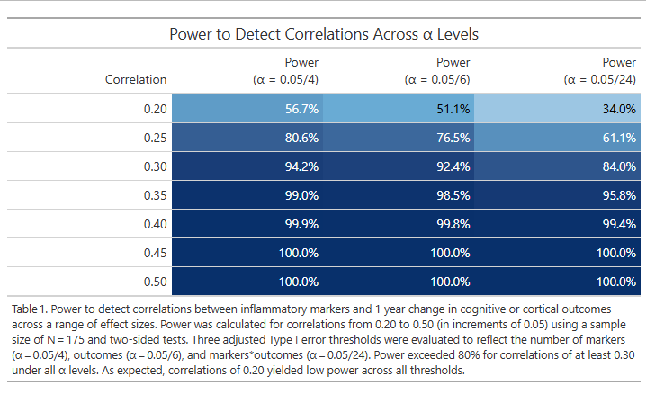
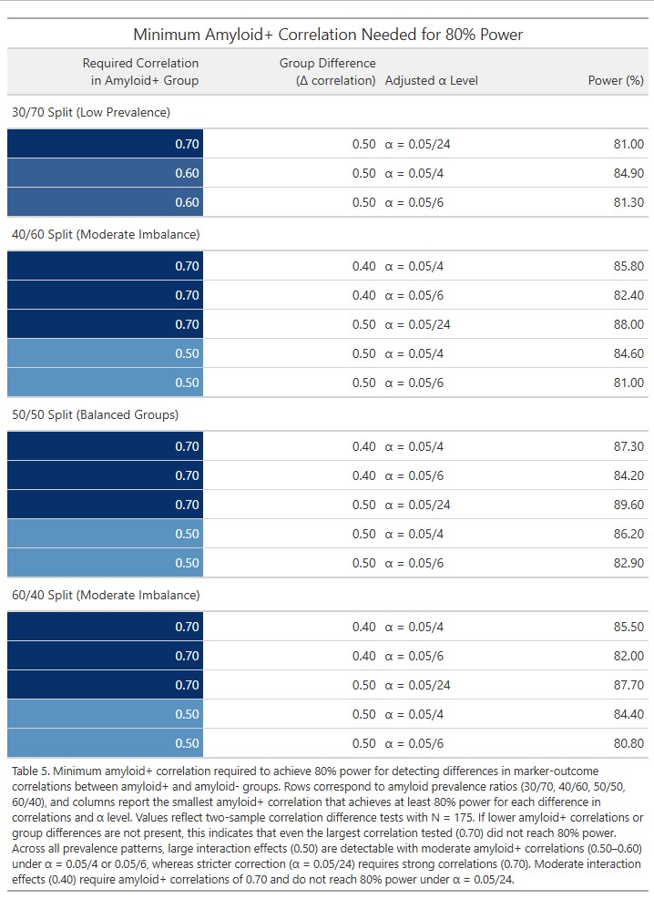

---
output:
  bookdown::pdf_document2:
    toc: false
    number_sections: false
documentclass: article
geometry: margin=1in
fontsize: 12pt
linestretch: 2
fig.cap: true
header-includes:
  - \usepackage{float}
  - \usepackage{caption}
  - \captionsetup{font=small}
  - \usepackage{graphicx}
  - \setkeys{Gin}{width=\linewidth, keepaspectratio}
editor_options: 
  chunk_output_type: console
---

```{r setup, include=FALSE}
knitr::opts_chunk$set(echo = TRUE)
library(ggplot2)
library(reshape2)
library(dplyr)
library(tidyr)
library(powertools)
library(gt)
library(scales)
library(stringr)
dat_prelim <- read.csv(here::here("P2/DataRaw", "PrelimData.csv"))
```

<!-- Title here: -->
# \textit{Alzheimer's Disease and Aging: Aims 1 and 2}

<!-- Name here: -->
Ezra Weible[^1]

[^1]: Biostatistics Masters Student, Colorado School of Public Health, CU Anschutz Medical Campus

```{r correlations, echo=FALSE}
cor_matrix <- cor(dat_prelim, use = "pairwise.complete.obs")
  # Correlations

fig_names <- c(
  "CORT_CNG3" = "1 year change in cortical thickness",
  "CVLT_CNG3" = "1 year change in CLVT",
  "IL_6" = "Baseline IL-6",
  "MCP_1" = "Baseline MCP-1"
) # Rename variables

rownames(cor_matrix) <- fig_names[rownames(cor_matrix)]
colnames(cor_matrix) <- fig_names[colnames(cor_matrix)]

fig1 <- ggplot(melt(cor_matrix), aes(Var1, Var2, fill = value)) +
  geom_tile() +
  scale_fill_distiller(
    palette = "RdBu",
    type = "div",
    direction = 1,
    limits = c(-1, 1)
  ) +
  theme_bw() +
  theme(
    axis.text.x = element_text(angle = 45, hjust = 1),
    axis.text.y = element_text(angle = 0),
    axis.title.x = element_blank(),
    axis.title.y = element_blank()
  ) +
  labs(
    title = "Correlation Heatmap of Preliminary Data",
    x = "",
    y = ""
  )
```
```{r aim1_power, echo=FALSE}
r_vals <- seq(0.2, 0.5, by = 0.05)
  # Correlation range
N <- 175
  # Sample size
alpha_markers <- 0.05 / 4   
alpha_outcomes <- 0.05 / 6  
alpha_all <- 0.05 / 24
  # Alpha levels
aim1_results <- data.frame(
  r = r_vals,
  power_alpha_markers = sapply(r_vals, function(r)
    corr.1samp(N = N, rho0 = 0, rhoA = r, alpha = alpha_markers, sides = 2)),
  power_alpha_outcomes = sapply(r_vals, function(r)
    corr.1samp(N = N, rho0 = 0, rhoA = r, alpha = alpha_outcomes, sides = 2)),
  power_alpha_all = sapply(r_vals, function(r)
    corr.1samp(N = N, rho0 = 0, rhoA = r, alpha = alpha_all, sides = 2))
) # Power calculation
```
```{r aim1_visualization, echo=FALSE, include=FALSE}
aim1_table <- aim1_results %>% 
  mutate(
    power_alpha_markers = round(power_alpha_markers, 3),
    power_alpha_outcomes = round(power_alpha_outcomes, 3),
    power_alpha_all = round(power_alpha_all, 3)
  ) %>% # Round digits
  gt() %>% # Convert to gt
  tab_header(
    title = "Power to Detect Correlations Across \u03B1 Levels",
  ) %>% # Labels
  cols_label(
    r = "Correlation",
    power_alpha_markers = html("Power<br>(\u03B1 = 0.05/4)"),
    power_alpha_outcomes = html("Power<br>(\u03B1 = 0.05/6)"),
    power_alpha_all = html("Power<br>(\u03B1 = 0.05/24)")
  ) %>% 
  fmt_percent(
    columns = starts_with("power"),
    decimals = 1
  ) %>% 
  data_color(
    columns = starts_with("power"),
    fn = scales::col_numeric(
      palette = c("#f7fbff", "#6baed6", "#08306b"),
      domain = c(0, 1)
    )
  ) %>% 
  tab_options(
    table.font.size = px(14),
    data_row.padding = px(6),
    heading.align = "center"
  ) %>%
  tab_footnote(
    footnote = "Table 4. Power to detect correlations between inflammatory markers and 1 year change in cognitive or cortical outcomes across a range of effect sizes. Power was calculated for correlations from 0.20 to 0.50 (in increments of 0.05) using a sample size of N = 175 and two-sided tests. Three adjusted Type I error thresholds were evaluated to reflect the number of markers (\u03B1 = 0.05/4), outcomes (\u03B1 = 0.05/6), and markers*outcomes (\u03B1 = 0.05/24). Power exceeded 80% for correlations of at least 0.30 under all \u03B1 levels. As expected, correlations of 0.20 yielded low power across all thresholds."
  )
```
```{r aim2_power, echo=FALSE}
N <- 175
r_high_vals <- seq(0.2, 0.7, by = 0.1)   
  # Plausible high-amyloid correlations
alpha_markers <- 0.05 / 4
alpha_outcomes <- 0.05 / 6
alpha_all <- 0.05 / 24
  # Alpha levels
rho_diffs <- seq(0.1, 0.5, by = 0.1)
  # Small to large interaction effects
ratios <- list(
  "30_70" = c(0.30, 0.70),
  "40_60" = c(0.40, 0.60),
  "50_50" = c(0.50, 0.50),
  "60_40" = c(0.60, 0.40)
) # Amyloid+:amyloid- ratios

compute_power <- function(N1, N2, rho_low, rho_high, alpha) {
  corr.2samp(n1 = N1, n.ratio = N2 / N1, rho1 = rho_low, rho2 = rho_high, alpha = alpha)
} # Power calculation

results <- list()
for (ratio_name in names(ratios)) {
  props <- ratios[[ratio_name]]
  N_high <- round(N * props[1])   
    # Amyloid+
  N_low  <- N - N_high            
    # Amyloid-
  tmp_list <- list()
  for (rho_high in r_high_vals) {
    for (d in rho_diffs) {
      rho_low <- rho_high - d
      if (rho_low < 0 | rho_low > 0.99) next
        # Skip invalid correlations
      tmp_list[[length(tmp_list) + 1]] <- data.frame(
        ratio = ratio_name,
        rho_high = rho_high,
        rho_low = rho_low,
        diff = d,
        power_alpha_markers = compute_power(N_low, N_high, rho_low, rho_high, alpha_markers),
        power_alpha_outcomes = compute_power(N_low, N_high, rho_low, rho_high, alpha_outcomes),
        power_alpha_all = compute_power(N_low, N_high, rho_low, rho_high, alpha_all)
      )}}
  results[[ratio_name]] <- do.call(rbind, tmp_list)
} # Loop over ratios * r_high * delta_rho * alpha
```
```{r aim2_visualizations, echo=FALSE, include=FALSE}
# Combine all results into one data frame
plot_df <- bind_rows(
  lapply(names(results), function(name) {
    results[[name]] %>% mutate(ratio = name)
  })
)

# Convert to long format
plot_long <- plot_df %>%
  pivot_longer(
    cols = starts_with("power_"),
    names_to = "alpha_type",
    values_to = "power"
  ) %>%
  mutate(
    alpha_type = recode(alpha_type,
      "power_alpha_markers" = "0.05/4",
      "power_alpha_outcomes" = "0.05/6",
      "power_alpha_all" = "0.05/24"
    ),
    power = power * 100 
  )

plot_long2 <- plot_long %>%
  filter(diff >= 0.3)
ratio_labels <- c(
  "30_70" = "30/70",
  "40_60" = "40/60",
  "50_50" = "50/50",
  "60_40" = "60/40"
)
fig2 <- ggplot(plot_long2, aes(x = rho_high, y = power, color = alpha_type)) +
  geom_line(size = 1.1) +
  geom_hline(yintercept = 80, linetype = "dashed", color = "gray40") +
  facet_grid(
    diff ~ ratio,
    labeller = labeller(
      ratio = ratio_labels,
      diff = function(x) paste0("\u0394 Correlation = ", x)
    )
  ) +
  labs(
    title = "Power Across Amyloid+ Correlation Levels",
    x = "Correlation in Amyloid+ Group",
    y = "Power (%)",
    color = "Adjusted \u03B1 Level"
  ) +
  scale_color_manual(
    values = c(
      "0.05/4" = "#053061", 
      "0.05/6"  = "#4393c3",
      "0.05/24"  = "#d6604d"
    )
  ) +
  theme_minimal(base_size = 14) +
  theme(
    strip.text = element_text(size = 14, face = "bold"),
    legend.position = "bottom"
  ) 

summary_80 <- plot_long %>%
  group_by(ratio, diff, alpha_type) %>%
  # keep only scenarios with at least 80% power
  filter(power >= 80) %>%
  # among those, find the smallest rho_high that achieves it
  slice_min(rho_high, with_ties = FALSE) %>%
  ungroup() %>%
  arrange(ratio, diff, alpha_type)

aim2_table <- summary_80 %>% 
  ungroup() %>% 
  mutate(
    alpha_type = paste0("\u03B1 = ", alpha_type),
    rho_high = round(rho_high, 2),
    diff = round(diff, 2),
    power = round(power, 1),
    ratio_label = case_when(
      ratio == "30_70" ~ "30/70 Split (Low Prevalence)",
      ratio == "40_60" ~ "40/60 Split (Moderate Imbalance)",
      ratio == "50_50" ~ "50/50 Split (Balanced Groups)",
      ratio == "60_40" ~ "60/40 Split (Moderate Imbalance)",
      TRUE ~ ratio
    )
  ) %>% 
  select(-rho_low, -ratio) %>% 
  arrange(ratio_label, diff, alpha_type) %>% 

  relocate(ratio_label, .after = last_col()) %>% 

  gt(groupname_col = "ratio_label") %>% 

  tab_header(
    title = "Minimum Amyloid+ Correlation Needed for 80% Power",
  ) %>% 

  cols_label(
    diff = html("<div style='white-space:normal;'>Group Difference<br>(\u0394 correlation)</div>"),
    alpha_type = html("<div style='white-space:normal;'>Adjusted \u03B1 Level</div>"),
    rho_high = html("<div style='white-space:normal;'>Required Correlation<br>in Amyloid+ Group</div>"),
    power = html("<div style='white-space:normal;'>Power (%)</div>")
  ) %>% 
  fmt_number(
    columns = c(diff, rho_high, power),
    decimals = 2
  ) %>% 
  data_color(
    columns = rho_high,
    fn = function(x) {
      scales::col_numeric(
        palette = c("#f7fbff", "#6baed6", "#08306b"),
        domain  = c(0.2, 0.7)
      )(x)
    }
  ) %>% 
  tab_options(
    table.font.size = px(14),
    data_row.padding = px(6),
    heading.align = "center",
    column_labels.background.color = "#f0f0f0"
  ) %>%
  tab_footnote(
    footnote = "Table 5. Minimum amyloid+ correlation required to achieve 80% power for detecting differences in marker-outcome correlations between amyloid+ and amyloid- groups. Rows correspond to amyloid prevalence ratios (30/70, 40/60, 50/50, 60/40), and columns report the smallest amyloid+ correlation that achieves at least 80% power for each difference in correlations and \u03B1 level. Values reflect two-sample correlation difference tests with N = 175. If lower amyloid+ correlations or group differences are not present, this indicates that even the largest correlation tested (0.70) did not reach 80% power. Across all prevalence patterns, large interaction effects (0.50) are detectable with moderate amyloid+ correlations (0.50–0.60) under \u03B1 = 0.05/4 or 0.05/6, whereas stricter correction (\u03B1 = 0.05/24) requires strong correlations (0.70). Moderate interaction effects (0.40) require amyloid+ correlations of 0.70 and do not reach 80% power under \u03B1 = 0.05/24."
  )
```

## Data Analysis

Aim 1 will evaluate whether peripheral inflammatory markers are associated with a 1 year decline in memory and cortical thickness in aMCI. The outcomes will be AD-signature cortical thickness (continuous) and five episodic memory and cognition outcomes (continuous; *Table 3*). All outcomes will be modeled as a 1 year change (Year 1 - Baseline), and models will include baseline value adjustments to allowing coefficients to be interpreted as the effect on the 1 year change. Hypothesis 1a will examine baseline cytokine (IL-6, TNF-$\alpha$) and chemokine (MCP-1, Eotaxin-1) levels as primary predictors; hypothesis 1b will test changes in these markers over the 1 year period. Each inflammatory marker will be analyzed in separate models to avoid multicollinearity, with exploratory joint models. The general model form for aim 1 will be $Outcome_{Y1-Y0} = \beta_0 + \beta_1 Marker_{Y1 \text{ or } Y1-Y0} + \beta_2 Outcome_{Y0} + \beta_n Covariates + \epsilon$ with an alternative hypothesis that $\beta_1 \neq 0$. 

Aim 2 will examine whether amyloid deposition modifies the relationship between inflammation and clinical progression. The primary hypothesis will test whether baseline amyloid deposition interacts with baseline inflammatory markers to predict a one year decline in episodic memory and cortical thickness. The secondary hypothesis will test whether baseline amyloid deposition interacts with the 1 year change in inflammatory markers to predict the one year decline in the outcomes. Models will follow a similar approach to aim 1, but will include baseline amyloid and an interaction. The general model form for aim 2 will be $Outcome_{Y1-Y0} = \beta_0 + \beta_1 Marker_{Y1 \text{ or } Y1-Y0} + \beta_2 Amyloid_{Y0} + \beta_3 Marker_{Y1 \text{ or } Y1-Y0} * Amyloid_{Y0} + \beta_4 Outcome_{Y0} + \beta_n Covariates + \epsilon$ with an alternative hypothesis that $\beta_3 \neq 0$. 

All models will adjust for age, sex, APOE status, and baseline outcome *a priori*. Additional potential covariates (including education, baseline CDR, GDS,BMI, hypercholesterolemia, blood pressure, NSAID use, immune-related health conditions, and cardiovascular risk) will be evaluated as potential confounders or precision variables. This evaluation will rely on simple exploratory checks of association among markers, outcomes, and candidate covariates. Variables that primarily improve precision will be added to the final models, improving power. Interpretation will be cautious in the presence of correlated variables. Participants included in the analytic dataset will be compared to those excluded due to missing data to assess potential bias. Given correlations among outcomes and markers, a mild multiple-comparison approach will be implemented. Once empirical correlations are known, more formal adjustments will be explored. For primary analyses, type I error will be controlled with an adjusted Bonferroni approach by dividing $\alpha$ by 4 (markers), 6 (outcomes), and 24 (markers*outcomes), applied separately within each hypothesis.

## Power

Because all longitudinal analyses model 1 year change adjusted for baseline values, the effect of interest can be expressed as the partial $R^2$ for the predictor. In practice, this can be approximated using the correlation between each inflammatory marker and each outcome. Preliminary data for two change outcomes (change in cortical thickness and change in CLVT) and two baseline inflammatory markers (IL-6 and MCP-1), produced correlations ranging from 0.2-0.7 (*Figure 1*), which informed the range of effect sizes examined. For both aims, power was calculated using the expected sample size of 175 and the three adjusted $\alpha$ levels described above ($0.05/4$, $0.05/6$, $0.05/24$) in R v4.5.2 using powertools 1.0.0 (corr.1samp and corr.2samp). These analyses provide a conservative estimate, as precision variables will reduce unexplained variance. 

Power for Aim 1 is summarized in *Table 4*. Even for the most conservative $\alpha$ tested, power is above 80\% when the correlation is at least 0.3. Power remains above 80\% for a correlation of 0.25 for $\alpha = 0.05/4$, but power is low for correlations of 0.2 and below across all $\alpha$s. 

As Aim 2 tests a continuous/continuous interaction, amyloid deposition was conservatively simplified to dichotomous: positive or negative. Power calculations varied the correlation in the amyloid+ group (0.2-0.7), the difference between amyloid groups (0.1-0.5), and the amyloid prevalence ratio (30/70, 40/60, 50/50, 60/40). These scenarios reflect plausible interaction effects and group distributions. 

Power for Aim 2 is summarized in *Table 5* and visualized in *Figure 2*. Across scenarios, larger interaction effects and more balanced amyloid+:amyloid- group ratios produced higher power, while stricter $\alpha$ thresholds required stronger correlations in the amyloid+ group. Across plausible prevalence patterns, large interaction effects (0.50) were detectable with moderate amyloid+ correlations under $\alpha$ = 0.05/4 or 0.05/6, whereas $\alpha$ = 0.05/24 required correlations of at least 0.70. Moderate interaction effects (0.40) required similarly strong correlations and did not reach 80% power under the strictest $\alpha$, and no interaction effects tested below 0.40 reached 80% power under the available conditions.

\newpage
## Appendix 

Code Directory: https://github.com/eweible/BIOS6624.git

File name: P2/Code/P2_Report.Rmd

Data Directory: C:/Users/weiblee/OneDrive/Documents/Anschutz/Spring 2026/6624_Advanced/Weible_Advanced/P2/DataRaw

\newpage

![Correlation heatmap showing associations among baseline inflammatory markers (IL-6, MCP-1) and 1 year change in AD-signature cortical thickness and CVLT. Colors represent Pearson correlation coefficients, with darker shades indicating stronger positive or negative associations. In preliminary data, IL-6 and MCP-1 were strongly correlated with each other (r=0.93) and showed moderate correlations with change in cortical thickness (r=-0.60 and -0.69, respectively) and change in CVLT performance (r=-0.26 and -0.32). These values informed the range of effect sizes examined in subsequent power analyses.](Figures/Correlation_Heatmap.png)

\newpage



\newpage

![Power to detect differences in marker-outcome correlations between amyloid+ and amyloid- groups across interaction sizes, amyloid prevalence ratios, and $\alpha$ levels. Lines show the power achieved for a given amyloid+ correlation, with separate panels for each interaction size (difference in correlations) and each amyloid+:amyloid- group ratio (30/70, 40/60, 50/50, 60/40). Power was calculated using two-sample correlation difference tests with N = 175 and adjusted Type I error thresholds ($\alpha$ = 0.05/4, 0.05/6, 0.05/24). The dashed horizontal line marks 80% power. Larger interaction effects and more balanced group ratios yield higher power, while stricter $\alpha$ thresholds require stronger underlying correlations in the amyloid+ group to achieve comparable power. Some differences in correlations never reach 80% power for any measured amyloid+ correlation.](Figures/aim2_power.png)

\newpage


