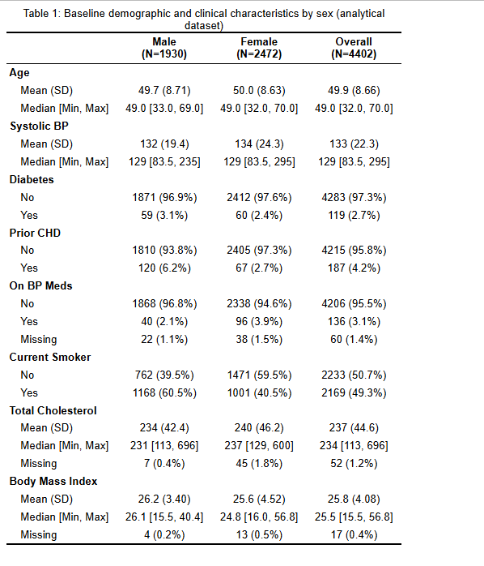
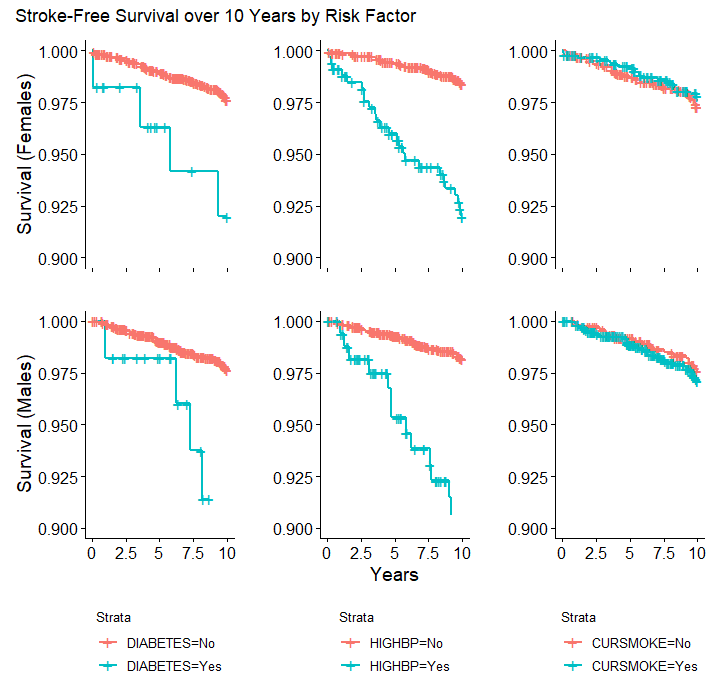
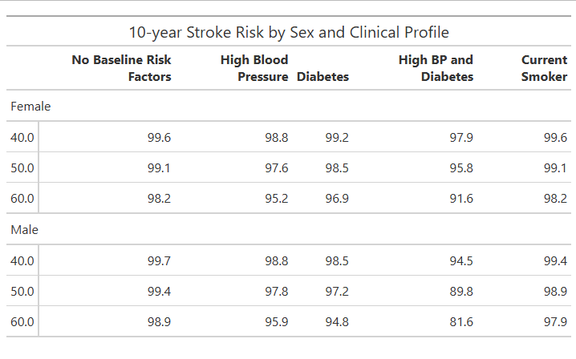
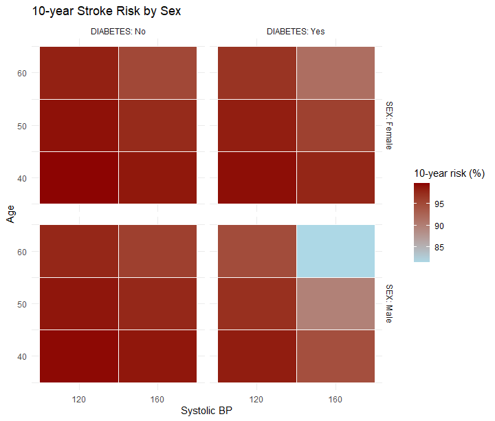

---
output:
  bookdown::pdf_document2:
    toc: false
    number_sections: false
documentclass: article
geometry: margin=1in
fontsize: 12pt
linestretch: 2
fig.cap: true
header-includes:
  - \usepackage{float}
editor_options: 
  chunk_output_type: console
---

```{r setup, include=FALSE}
knitr::opts_chunk$set(echo = TRUE)
library(dplyr)
library(tidyr)
library(survival)
library(survminer)
library(MASS)
library(here)
library(table1)
library(ggplot2)
library(patchwork)
library(gt)
dat_raw <- read.csv(here::here("P3/DataRaw", "frmgham2.csv"))
```

<!-- Title here: -->
# \textit{Framingham Longitudinal Stroke Risk Profile}

<!-- Name here: -->
Ezra Weible[^1]

[^1]: Biostatistics Masters Student, Colorado School of Public Health, CU Anschutz Medical Campus

```{r dat_cleaning, echo=FALSE}
dat_10 <- dat_raw %>%
  filter(!(STROKE == 1 & TIMESTRK == 0)) %>%
    # Remove baseline stroke
  mutate(
    time_yrs = TIMESTRK / 365.25,
    time_10 = pmin(time_yrs, 10),
    stroke_event = if_else(STROKE == 1 & time_yrs <= 10, 1, 0)
  ) # Adjust time vars
dat_10 <- dat_10 %>%
  dplyr::select(
    RANDID, STROKE, SEX, time_10, stroke_event, AGE, DIABETES, SYSBP, PREVCHD, 
    BPMEDS, CURSMOKE, TOTCHOL, BMI, PERIOD
  ) # Restrict to needed vars
dat_10 <- dat_10 %>%
  mutate(
    SEX = factor(SEX, labels = c("Male", "Female")),
    DIABETES = factor(DIABETES, levels = c(0,1), labels = c("No","Yes")),
    CURSMOKE = factor(CURSMOKE, levels = c(0,1), labels = c("No","Yes")),
    PREVCHD = factor(PREVCHD, levels = c(0,1), labels = c("No","Yes")),
    BPMEDS = factor(BPMEDS, levels = c(0,1), labels = c("No","Yes"))
  ) # Convert to factors
dat_cc <- dat_10 %>%
  filter(!is.na(time_10), !is.na(stroke_event)) %>%
  filter(complete.cases(
    AGE, SYSBP, DIABETES, PREVCHD, BPMEDS, CURSMOKE, TOTCHOL, BMI, PERIOD
  )) # Complete case dataset for all vars
```
```{r km_logrank, echo=FALSE}
dat_cc <- dat_cc %>%
  filter(PERIOD == 1) %>%
  mutate(HIGHBP = if_else(SYSBP >= 160, "Yes", "No"))
dat_male <- dat_cc %>% filter(SEX == "Male")
dat_female <- dat_cc %>% filter(SEX == "Female")

# surv_object <- Surv(time = dat_cc$time_10, event = dat_cc$stroke_event)
surv_object_m <- Surv(time = dat_male$time_10, event = dat_male$stroke_event)
surv_object_f <- Surv(time = dat_female$time_10, event = dat_female$stroke_event)

# ## By sex
# fit_sex <- survfit(surv_object ~ SEX, data = dat_cc)
# p1 <- ggsurvplot(fit_sex, data = dat_cc, ylim = c(0.90, 1.00),
#            xlab = "Years", ylab = "Stroke-free survival")$plot + theme(legend.position = "bottom", legend.direction = "vertical")
# 
# survdiff_sex <- survdiff(surv_object ~ SEX, data = dat_cc)

## By diabetes
fit_diab_m <- survfit(surv_object_m ~ DIABETES, data = dat_male)
p2_m <- ggsurvplot(fit_diab_m, data = dat_male, ylim = c(0.90, 1.00),
           xlab = "", ylab = "Survival (Males)")$plot + theme(legend.position = "bottom", legend.direction = "vertical")
survdiff_diab_m <- survdiff(surv_object_m ~ DIABETES, data = dat_male)
fit_diab_f <- survfit(surv_object_f ~ DIABETES, data = dat_female)
p2_f <- ggsurvplot(fit_diab_f, data = dat_female, ylim = c(0.90, 1.00),
           xlab = "", ylab = "Survival (Females)")$plot + 
  theme(legend.position = "none", axis.text.x = element_blank(), axis.line.x = element_blank())
survdiff_diab_f <- survdiff(surv_object_f ~ DIABETES, data = dat_female)

## By high BP
fit_bp_m <- survfit(Surv(time_10, stroke_event) ~ HIGHBP, data = dat_male)
p3_m <- ggsurvplot(fit_bp_m, data = dat_male, ylim = c(0.90, 1.00),
           xlab = "Years", ylab = "")$plot + theme(legend.position = "bottom", legend.direction = "vertical")
survdiff_bp_m <- survdiff(Surv(time_10, stroke_event) ~ HIGHBP, data = dat_male)
fit_bp_f <- survfit(Surv(time_10, stroke_event) ~ HIGHBP, data = dat_female)
p3_f <- ggsurvplot(fit_bp_f, data = dat_female, ylim = c(0.90, 1.00),
           xlab = "", ylab = "")$plot + 
  theme(legend.position = "none", axis.text.x = element_blank(), axis.line.x = element_blank())
survdiff_bp_f <- survdiff(Surv(time_10, stroke_event) ~ HIGHBP, data = dat_female)

## By smoking
fit_smoke_m <- survfit(surv_object_m ~ CURSMOKE, data = dat_male)
p4_m <- ggsurvplot(fit_smoke_m, data = dat_male, ylim = c(0.90, 1.00),
           xlab = "", ylab = "")$plot + theme(legend.position = "bottom", legend.direction = "vertical")
survdiff_smoke_m <- survdiff(surv_object_m ~ CURSMOKE, data = dat_male)
fit_smoke_f <- survfit(surv_object_f ~ CURSMOKE, data = dat_female)
p4_f <- ggsurvplot(fit_smoke_f, data = dat_female, ylim = c(0.90, 1.00),
           xlab = "", ylab = "")$plot + 
  theme(legend.position = "none", axis.text.x  = element_blank(), axis.line.x = element_blank())
survdiff_smoke_f <- survdiff(surv_object_f ~ CURSMOKE, data = dat_female)

fig1 <- (p2_f | p3_f | p4_f)/(p2_m | p3_m | p4_m) + 
  plot_annotation(title = "Stroke-Free Survival over 10 Years by Risk Factor")
fig1
```
```{r cox_ph, echo=FALSE, results='hide'}
## Males
cox_male_full <- coxph(Surv(time_10, stroke_event) ~ AGE + SYSBP + DIABETES + 
                         PREVCHD + BPMEDS + CURSMOKE + TOTCHOL + BMI, 
                       data = dat_male) # Full model
cox_male_min <- coxph(Surv(time_10, stroke_event) ~ AGE + DIABETES + SYSBP,
                      data = dat_male) # Smallest model
cox_male_step <- stepAIC(cox_male_full, direction = "backward", 
                      scope = list(lower = formula(cox_male_min),
                                   upper = formula(cox_male_full)), k = 2)
  # Backward selection (AIC)
    # Male: Age, SysBP, Diabetes, Cur Smoke

## Females
cox_female_full <- coxph(Surv(time_10, stroke_event) ~ AGE + SYSBP + DIABETES +
                           PREVCHD + BPMEDS + CURSMOKE + TOTCHOL + BMI,
                         data = dat_female) # Full model
cox_female_min <- coxph(Surv(time_10, stroke_event) ~ AGE + DIABETES + SYSBP,
                      data = dat_female) # Smallest model
cox_female_step <- step(cox_female_full, direction = "backward", , 
                      scope = list(lower = formula(cox_female_min),
                                   upper = formula(cox_female_full)), k = 2)
  # Backward selection (AIC)
    # Female: Age, SysBP, Diabetes, *Added CurSmoke to match with males & because AIC was not dramatically different

dat_cc <- dat_10 %>%
  filter(!is.na(time_10), !is.na(stroke_event)) %>%
  filter(complete.cases(
    AGE, SYSBP, DIABETES, CURSMOKE, PERIOD
  )) %>% # Complete case dataset for all vars
  filter(PERIOD == 1)
dat_male <- dat_cc %>% filter(SEX == "Male")
dat_female <- dat_cc %>% filter(SEX == "Female")

summary(cox_male <- coxph(Surv(time_10, stroke_event) ~ AGE + SYSBP + DIABETES + CURSMOKE,
    data = dat_male))
ph_male <- cox.zph(cox_male)
fig2_male <- ggcoxzph(ph_male)
  # Check PH

summary(cox_female <- coxph(Surv(time_10, stroke_event) ~ AGE + SYSBP + DIABETES + CURSMOKE,
    data = dat_female))
ph_female <- cox.zph(cox_female)
fig2_female <- ggcoxzph(ph_female)
  # Check PH
```
```{r prob_10yr, echo=FALSE}
ages <- c(40, 50, 60)

## Males
profiles_male <- expand.grid(
  AGE = ages,
  SYSBP = c(120, 160),
    # Normal vs. high
  DIABETES = c("No", "Yes")
) %>% 
  mutate(
    PREVCHD = "No",
    BPMEDS = "No",
    CURSMOKE = "No",
    TOTCHOL = mean(dat_male$TOTCHOL, na.rm = TRUE),
    BMI = mean(dat_male$BMI, na.rm = TRUE)
  ) # Profiles for the combos of BP/diabetes
profiles_male_other <- expand.grid(
  AGE = ages
) %>%
  mutate(
    SYSBP = 120,
    DIABETES = "No",
    PREVCHD = "No",
    BPMEDS = "No",
    CURSMOKE = "Yes",
    TOTCHOL = mean(dat_male$TOTCHOL, na.rm = TRUE),
    BMI = mean(dat_male$BMI, na.rm = TRUE)
  ) # Other profile: BP meds
profiles_male <- bind_rows(profiles_male, profiles_male_other)
  # Combine profiles
base_male <- survfit(cox_male_step, newdata = profiles_male)
  # Baseline survival
pred_male <- summary(base_male, times = 10)
  # Extract survival at 10 years
stroke_prob_10_male <- pred_male$surv
  # 10-year stroke probability = S(10)

## Females
profiles_female <- expand.grid(
  AGE = ages,
  SYSBP = c(120, 160),
    # Normal vs. high
  DIABETES = c("No", "Yes")
) %>% 
  mutate(
    PREVCHD = "No",
    BPMEDS = "No",
    CURSMOKE = "No",
    TOTCHOL = mean(dat_female$TOTCHOL, na.rm = TRUE),
    BMI = mean(dat_female$BMI, na.rm = TRUE)
  ) # Profiles for the combos of BP/diabetes
profiles_female_other <- expand.grid(
  AGE = ages
) %>%
  mutate(
    SYSBP = 120,
    DIABETES = "No",
    PREVCHD = "No",
    BPMEDS = "No",
    CURSMOKE = "Yes",
    TOTCHOL = mean(dat_female$TOTCHOL, na.rm = TRUE),
    BMI = mean(dat_female$BMI, na.rm = TRUE)
  ) # Other profile: BP meds
profiles_female <- bind_rows(profiles_female, profiles_female_other)
  # Combine profiles
base_female <- survfit(cox_female_step, newdata = profiles_female)
  # Baseline survival
pred_female <- summary(base_female, times = 10)
  # Extract survival at 10 years
stroke_prob_10_female <- pred_female$surv
  # 10-year stroke probability = S(10)
```
```{r vis_10yr, echo=FALSE}
male_tbl <- profiles_male %>%
  mutate(
    prob = as.numeric(stroke_prob_10_male) * 100
  ) %>% # Convert to percent
  mutate(
    Profile = case_when(
      CURSMOKE == "Yes" ~ "Other",
      SYSBP == 120 & DIABETES == "No" ~ "Baseline",
      SYSBP == 160 & DIABETES == "No" ~ "High BP",
      SYSBP == 120 & DIABETES == "Yes" ~ "Diabetes",
      SYSBP == 160 & DIABETES == "Yes" ~ "Both"
    )
  ) %>%
  dplyr::select(AGE, Profile, prob)
male_table_final <- male_tbl %>%
  pivot_wider(names_from = Profile, values_from = prob) %>%
  arrange(AGE)
female_tbl <- profiles_female %>%
  mutate(
    prob = as.numeric(stroke_prob_10_female) * 100
  ) %>% # Convert to percent
  mutate(
    Profile = case_when(
      CURSMOKE == "Yes" ~ "Other",
      SYSBP == 120 & DIABETES == "No"  ~ "Baseline",
      SYSBP == 160 & DIABETES == "No"  ~ "High BP",
      SYSBP == 120 & DIABETES == "Yes" ~ "Diabetes",
      SYSBP == 160 & DIABETES == "Yes" ~ "Both"
    )
  ) %>%
  dplyr::select(AGE, Profile, prob)
female_table_final <- female_tbl %>%
  pivot_wider(names_from = Profile, values_from = prob) %>%
  arrange(AGE)
male_table_final <- male_table_final %>% mutate(SEX = "Male")
female_table_final <- female_table_final %>% mutate(SEX = "Female")

combined_table <- bind_rows(female_table_final, male_table_final) %>%
  relocate(SEX) %>%
  arrange(SEX, AGE) %>%
  gt(rowname_col = "AGE", groupname_col = "SEX") %>%
  tab_header(
    title = "10-year Stroke Risk by Sex and Clinical Profile"
  ) %>%
  fmt_number(
    columns = where(is.numeric),
    decimals = 1
  ) %>%
  cols_label(
    AGE = "Age",
    Baseline = "No Baseline Risk Factors",
    `High BP` = "High Blood Pressure",
    Diabetes = "Diabetes",
    Both = "High BP and Diabetes",
    Other = "Current Smoker"
  ) %>%
  tab_style(
    style = cell_text(weight = "bold"),
    locations = cells_column_labels(everything())
  ) %>%
  tab_options(
    row_group.as_column = FALSE
  )

male_heat <- profiles_male %>%
  mutate(
    SEX = "Male",
    prob = as.numeric(stroke_prob_10_male) * 100,
    SYSBP = factor(SYSBP),
    DIABETES = factor(DIABETES),
    BPMEDS = factor(BPMEDS)
  )

female_heat <- profiles_female %>%
  mutate(
    SEX = "Female",
    prob = as.numeric(stroke_prob_10_female) * 100,
    SYSBP = factor(SYSBP),
    DIABETES = factor(DIABETES),
    BPMEDS = factor(BPMEDS)
  )

heat_all <- bind_rows(male_heat, female_heat)
fig3 <- ggplot(heat_all, aes(x = SYSBP, y = AGE, fill = prob)) +
  geom_tile(color = "white") +
  facet_grid(SEX ~ DIABETES, labeller = label_both) +
  scale_fill_gradient(low = "lightblue", high = "darkred",
                      name = "10-year risk (%)") +
  labs(
    title = "10-year Stroke Risk by Sex",
    x = "Systolic BP",
    y = "Age"
  ) +
  theme_minimal()
```
```{r time_var, echo=FALSE, results='hide'}
dat_long <- dat_raw %>%
  filter(PERIOD %in% c(1,2,3)) %>%
  dplyr::select(RANDID, PERIOD, SEX, SYSBP, DIABETES)

dat_long %>%
  group_by(SEX, PERIOD) %>%
  summarise(mean_SYSBP = mean(SYSBP, na.rm = TRUE),
            sd_SYSBP   = sd(SYSBP, na.rm = TRUE))

dat_long %>%
  group_by(SEX, PERIOD) %>%
  summarise(diabetes_prev = mean(DIABETES == 1, na.rm = TRUE))

p4 <- ggplot(dat_long, aes(x = PERIOD, y = SYSBP, color = SEX)) +
  stat_summary(fun = mean, geom = "line") +
  labs(x = "Exam Period", y = "Mean Systolic BP")

p5 <- ggplot(dat_long, aes(x = PERIOD, y = DIABETES, color = SEX)) +
  stat_summary(fun = mean, geom = "line") +
  labs(x = "Exam Period", y = "Diabetes Prevalence")

fig4 <- p4 / p5 + 
  plot_annotation(title = "Time Varying Covariates")
```


## Introduction

This project investigates stroke risk in the Framingham Heart Study, a long-term prospective cohort that has followed adults in Framingham, Massachusetts for cardiovascular outcomes since 1948. This analysis uses a subset of 4,434 participants with baseline measurements of cardiovascular risk factors and stroke outcomes. To ensure that covariates reflect clinically relevant exposure windows, this project focuses on the first 10 years of follow-up. 

The primary objective is to identify baseline predictors of time to first stroke, analyzed separately for males and females. A secondary aim is to estimate 10 year stroke probabilities for several clinically relevant risk profiles, defined by age, systolic blood pressure (BP), and diabetes and smoking status. Because systolic BP and diabetes were measured at three exam periods, an additional aim is to describe how these risk factors change over time and to discuss the implications for analyses that rely only on baseline values.

## Methods

All analyses will be conducted in R v4.5.2 (2025-10-31 ucrt). Participants with evidence of stroke at baseline will be excluded. Follow-up time will be defined using TIMESTRK and restricted to 10 years. Individuals who experience a non-stroke event before 10 years will be censored at the time of event. Events occurring after 10 years will be censored at 10 years. A new event indicator will be created to capture first stroke within the 10 year window.

Baseline covariates include age, systolic blood pressure, diabetes, smoking status, BMI, cholesterol, coronary heart disease, and blood pressure medication use. Variables will be checked for implausible values and recoded when necessary. Missingness will be summarized descriptively. Complete case analysis will be used for the final Cox models. Analyses will be stratified by sex. Age, systolic blood pressure, and diabetes will be included *a priori*, additional baseline covariates will be evaluated using backwards selection based on AIC. Differences in final models by sex will be noted and interpreted as needed. 

Kaplan–Meier curves and log-rank tests will be used to compare stroke-free survival across baseline risk factors. The primary analysis will use Cox proportional hazards models. Proportional hazards assumptions will be assessed using Schoenfeld residuals and log-minus-log survival plots. For each sex, 10 year predicted stroke probabilities will be estimated from the final Cox model for five risk profiles at ages 40, 50, and 60. The risk profiles are: 1. No baseline risk factors, 2. High systolic blood pressure ($\geq$ 160), 3. Diabetes, 4. Both high systolic blood pressure and diabetes, 5. One additional profile chosen based on model results. Although the primary analysis will only use baseline covariates, systolic blood pressure and diabetes will be summarized across the three exam periods to assess how much they change over time and if time-varying covariate models may be more appropriate.

## Results

KM:
* Sex: KM curves overlap throughout (no difference in survival, supported by log-rank X^2 = 0.4, p = 0.5).
* Diabetes: KM curves overlap mostly in the first 5 years (small numbers of early events). Diverge strongly later (log-rank: X^2 = 34.3, p < 0.001).
* BP: Strong visual difference on KM curves and log-rank (high BP has much higher stroke rate, separate cleanly). X^2 = 149, p << 0.001.

Cox:
* Males: diabetes and sysBP dominate the stroke risk, age and BP meds also contribute, CURSMOKE and TOTCHOL are marginal/borderline may not actually need to be included
* Females: diabetes is a weaker predictor than for men, sysBP still dominates. Age, BP meds, and PREVCHD also contribute
* PH tests look good overall. Only diabetes mildly violates for men (p = 0.008, more curvy), globally is good for each.


## Discussion


\newpage
## Appendix 

Code Directory: https://github.com/eweible/BIOS6624.git

File name: P3/Code/P3_Report.Rmd

Data Directory: C:/Users/weiblee/OneDrive/Documents/Anschutz/Spring 2026/6624_Advanced/Weible_Advanced/P3/DataRaw

```{r tab1, echo=FALSE, results='hide'}
table1(~ AGE + SYSBP + DIABETES + PREVCHD + BPMEDS + CURSMOKE + TOTCHOL + BMI 
       | SEX, data = dat_cc)
```





```{r fig2, echo=FALSE}
fig2_male
fig2_female
```




```{r fig4, echo=FALSE}
fig4
```

