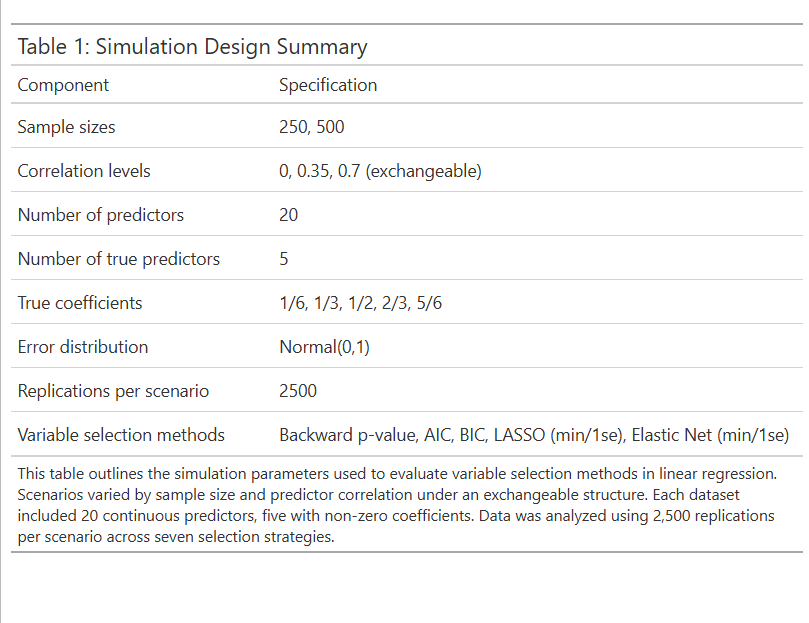
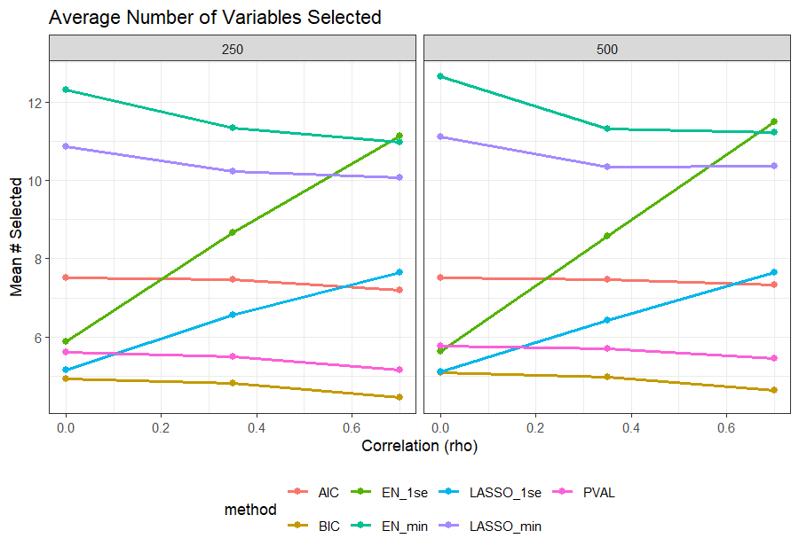
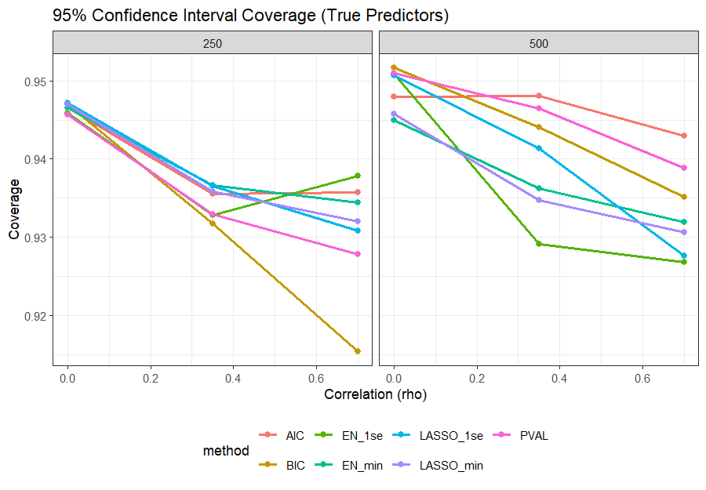
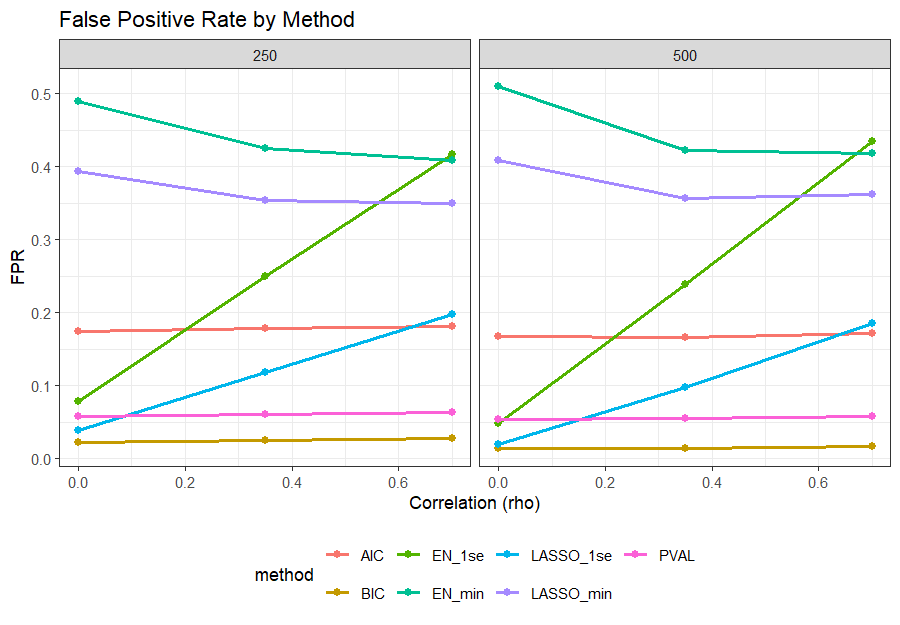
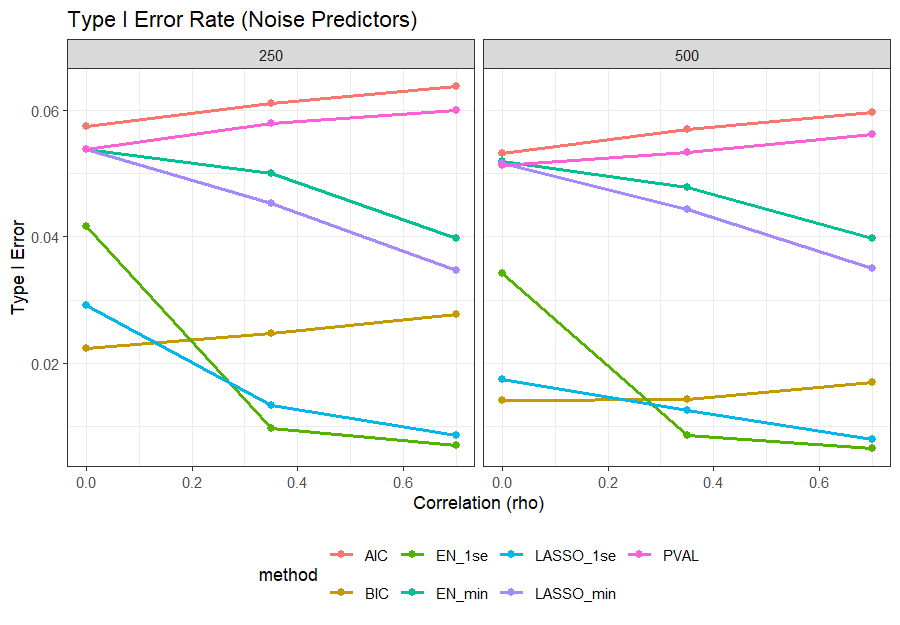
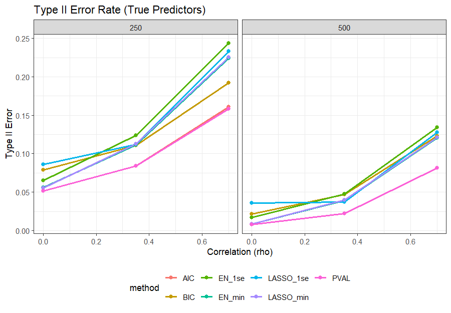

---
output:
  bookdown::pdf_document2:
    toc: false
    number_sections: false
documentclass: article
geometry: margin=1in
fontsize: 12pt
linestretch: 2
fig.cap: true
header-includes:
  - \usepackage{float}
bibliography: P4.bib
csl: alex_vancouver.csl
---

```{r setup, include=FALSE}
knitr::opts_chunk$set(echo = TRUE)
```

<!-- Title here: -->
# \textit{Simulation-Based Investigation of Variable Selection Methods}

<!-- Name here: -->
Ezra Weible[^1]

[^1]: Biostatistics Masters Student, Colorado School of Public Health, CU Anschutz Medical Campus

## Introduction

Variable selection is frequently used in regression modeling to identify a subset of predictors that meaningfully explain variation in an outcome. Although common in applied research, selection procedures can introduce instability, inflate Type I error, and distort post selection inference, particularly in moderate sample sizes or when predictors are correlated. Despite these limitations, methods such as stepwise selection, AIC/BIC criteria, and penalized regression remain widely implemented. Therefore, understanding how these approaches behave under realistic conditions is important for investigators who rely on them.

This project investigates several common variable selection methods in linear regression using simulations and aims to evaluate how variable selection procedures perform when the true underlying model is known. Datasets will include 20 continuous predictors, 5 with (true) non-zero effects. Two sample sizes (N = 250 and N = 500) and several predictor correlation structures will be examined to represent moderate sample size studies with varying multicollinearity. Each method (backward selection based on p-values, AIC [@Akaike1974], BIC [@Schwarz1978], LASSO [@Tibshirani1996], and elastic net[@Zou2005]) will be assessed on its ability to identify true predictors, avoid extraneous variables, and produce unbiased and well-calibrated estimates.

## Model Notation

Data were generated from the linear model $Y = \beta_0 + \Sigma_{j=1}^{20} \beta_j X_j + \epsilon$, with $\epsilon \sim N(0,1)$. Predictors $X_1$ to $X_5$ had true coefficients ranging from $1/6$ to $5/6$ in increments of $1/6$, and the remaining 15 predictors had coefficients of zero. Predictor correlation followed an exchangeable structure with $\rho = 0, 0.35\text{, and } 0.7$. The case $\rho = 0$ corresponds to independent predictors. 

# Methods 

All analyses were be conducted in R v4.5.2 (2025-10-31 ucrt) [@R]. Data was be generated using gen_data from the hdrm package. Five variable selection strategies will be applied to each simulation dataset: 

1. Backward selection using p-values, 
2. AIC-based selection, 
3. BIC-based selection, 
4. LASSO, and 
5. Elastic net. 

Backward selection using p-values removed variables sequentially using p < 0.05, equivalent to using step() with k = qchisq(0.95, 1). AIC and BIC based backward selection used penalties of $k = 2$ and $k = log(n)$, respectively. LASSO and elastic net models were fit using glmnet with standardized predictors with $\alpha$ = 1 for LASSO, $\alpha = 0.5$ for elastic net. For each penalized method, two tuning parameters will be evaluated: lambda.min (minimum cross-validated error) and lambda.1se (largest $\lambda$ within one SE of the minimum) from 10-fold cross-validation. Predictors with non-zero coefficients at the chosen $\lambda$ were considered selected. Because glmnet does not provide standard errors, each model was refit using lm to obtain coefficient estimates, confidence intervals, and p-values. Predictors not selected were treated as non-significant. This reflects how investigators typically interpret selected models and aligns with the project's focus on post-selection inference.

# Simultaion

Each scenario (combination of sample size and correlation level) was replicated 2,500 times, chosen to achieve a Monte Carlo standard error of approximately 0.01 for proportions near 0.5 [@Morris2019]. For each replication, a dataset was generated, all selection methods were applied, and the selection model was refit. Across replications, performance was summarized using: 

* True Positive Rates (TPR): proportion of simulations selecting each true predictor 
* False Positive Rates (FPR): proportion of simulations selecting any noise predictor
* Bias: mean difference between estimated and true coefficients among selected true predictors
* Coverage: proportion of 95\% confidence intervals containing the true coefficient
* Type I error: proportion of noise predictors declared significant 
* Type II error: proportion of true predictors not declared significant 

**Table 1** summarizes the simulation design.

# Results

Across all scenarios, the methods showed clear and consistent differences in selection behavior (Tables 2-4). LASSO_min and EN_min achieved the highest true positive rates (roughly 0.99-1.00), identifying nearly all true predictors regardless of sample size or correlation. However, these methods also selected the largest number of noise variables, with false positive rates (FPR) ranging from 0.35 to 0.49 and an average of 10-13 predictors retained per model.

BIC produced the sparsest models, selecting approximately five predictors on average and yielding the lowest FPRs (0.01-0.03). This conservatism came at the cost of lower TPRs, particularly under higher correlation (TPR decreasing from about 0.92 at $\rho = 0$ to about 0.81 at $\rho = 0.7$). AIC and backward p‑value selection fell between these extremes, with TPRs around 0.90-0.96 and FPRs around 0.05-0.18.

Penalized methods using the lambda.1se rule provided a more conservative alternative to lambda.min. LASSO.1se and EN.1se achieved TPRs of 0.94-0.98 with substantially lower FPRs than their lambda_min counterparts. EN.1se was more sensitive to correlation, with the number of selected variables increasing from about 6 at $\rho = 0$ to about 11 at $\rho = 0.7$.

Bias was small for all methods, though penalized approaches exhibited the expected negative shrinkage bias. Coverage of 95\% confidence intervals was similar across methods (roughly 0.93-0.95), reflecting the fact that inference was computed after refitting with OLS. Type I error closely mirrored FPR patterns, while Type II error was highest for BIC and lowest for the lambda.min penalized methods.

# Discussion 

This simulation study highlights the tradeoffs inherent in variable selection for linear regression. LASSO.min and EN.min were the most sensitive methods, consistently identifying nearly all true predictors, but at the cost of selecting many noise variables and inflating Type I error. These methods may be appropriate when the goal is to avoid missing true signals, but they produce models that are larger and less interpretable. In practical terms, this means that methods like LASSO.min find almost all real predictors but also include many false ones, while BIC is very cautious and rarely includes noise but sometimes misses real effects.

BIC was the most conservative method, selecting approximately the true model size and maintaining very low false positive rates. However, this came with reduced sensitivity, particularly under moderate correlation, where BIC frequently omitted true predictors. AIC and backward p‑value selection offered intermediate performance, balancing TPR and FPR but remaining sensitive to correlation.
The lamdba.1se versions of the lasso and elastic net provided a useful compromise, achieving high TPR with substantially lower FPR than lamdba.min. These methods may be preferable in settings with correlated predictors, though EN.1se showed increasing instability as correlation increased.

Across all methods, post selection inference remained imperfect. Although coverage was close to nominal due to refitting with OLS, Type I error was inflated for methods that frequently selected noise variables, and shrinkage bias persisted for penalized approaches.

Overall, the choice of method should depend on the scientific goal. When avoiding false positives is critical, BIC is the safest option. When identifying all potential predictors is more important, penalized methods with lambda.min perform best. For balanced performance, AIC, p value backward selection, or penalized methods with lambda.1se offer reasonable compromises.

# Future Work

Several extensions could strengthen and broaden the findings from this simulation study. First, although this project focused on an exchangeable correlation structure, alternative patterns such as autoregressive (AR(1)) or block‑structured correlation could be examined to assess whether the relative performance of selection methods depends on the form of multicollinearity rather than its magnitude alone [@Chong2005]. Second, the true effect sizes were fixed and moderately large; exploring smaller or heterogeneous effect sizes would provide insight into how these methods behave when signals are weak or sparse. Third, this study evaluated post‑selection inference using ordinary least squares refitting, but emerging approaches such as selective inference, debiased lasso, or bootstrap‑based stability selection may offer more reliable uncertainty quantification and could be incorporated in future work.

In addition, the simulation framework could be extended to higher‑dimensional settings (p > n) or to generalized linear models to evaluate whether the patterns observed here generalize beyond the linear Gaussian case. Finally, because variable selection is often used in applied research to support scientific interpretation, future work could investigate how often different methods recover the correct ordering or relative importance of predictors, not just their inclusion. Together, these extensions would provide a more comprehensive understanding of the strengths and limitations of common selection procedures across a wider range of practical scenarios.

\newpage
## References

\vspace{2mm} 

<div id="refs"></div>

\newpage
## Appendix 

Code Directory: https://github.com/eweible/BIOS6624.git

File name: P4/Code/P4_Data_Analysis.Rmd

## Tables and Figures


```{r echo = FALSE}
results_table <- readRDS(here::here("P4/Code/Figures", "results_table.rds"))
results_table
```








```{r echo = FALSE, fig.cap="Figure 4: (a) Type I Error and (b) Type II Error", fig.show='hold', out.width='48%'}


```


