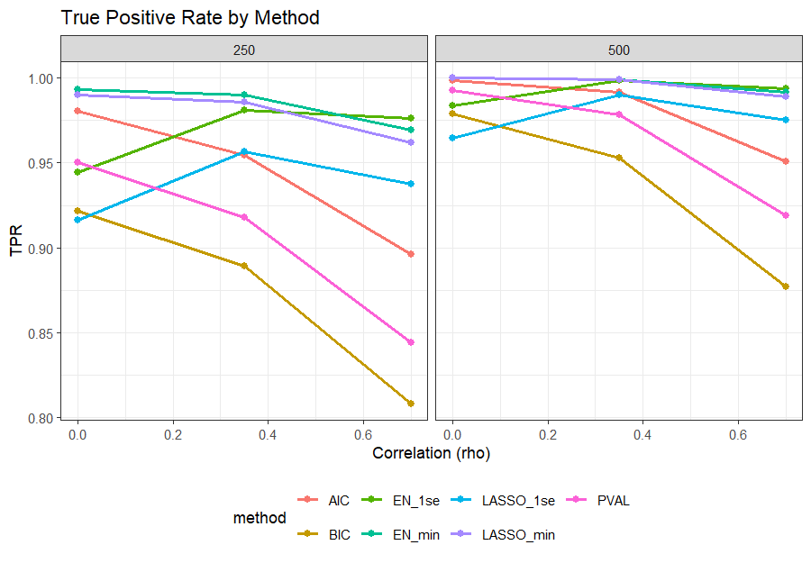

---
output:
  bookdown::pdf_document2:
    toc: false
    number_sections: false
    latex_engine: xelatex
documentclass: article
geometry: margin=1in
fontsize: 12pt
linestretch: 2
fig.cap: true
header-includes:
  - \usepackage{float}
bibliography: P4.bib
csl: alex_vancouver.csl
---

```{r setup, include=FALSE}
knitr::opts_chunk$set(echo = TRUE)
library(dplyr)
library(gt)
```

<!-- Title here: -->
# \textit{Simulation-Based Investigation of Variable Selection Methods}

<!-- Name here: -->
Ezra Weible[^1]

[^1]: Biostatistics Masters Student, Colorado School of Public Health, CU Anschutz Medical Campus

## Introduction

Variable selection is frequently used in regression modeling to identify a subset of predictors that meaningfully explain variation in an outcome. Although common in applied research, selection procedures can introduce instability, inflate Type I error, and distort post selection inference, particularly in moderate sample sizes or when predictors are correlated. Despite these limitations, methods such as stepwise selection, AIC/BIC criteria, and penalized regression remain widely implemented. Therefore, understanding how these approaches behave under realistic conditions is important for investigators who rely on them.

This project investigates several common variable selection methods in linear regression using simulations and aims to evaluate how variable selection procedures perform when the true underlying model is known. Datasets will include 20 continuous predictors, 5 with (true) non-zero effects. Two sample sizes (N = 250 and N = 500) and several predictor correlation structures will be examined to represent moderate sample size studies with varying multicollinearity. Each method (backward selection based on p-values, AIC [@Akaike1974], BIC [@Schwarz1978], LASSO [@Tibshirani1996], and elastic net[@Zou2005]) will be assessed on its ability to identify true predictors, avoid extraneous variables, and produce unbiased and well-calibrated estimates. These scenarios reflect common applied settings where sample sizes are moderate and predictors exhibit varying degrees of correlation.

## Model Notation

Data were generated from the linear model $Y = \beta_0 + \Sigma_{j=1}^{20} \beta_j X_j + \epsilon$, with $\epsilon \sim N(0,1)$. Predictors $X_1$ to $X_5$ had true coefficients ranging from $1/6$ to $5/6$ in increments of $1/6$, and the remaining 15 predictors had coefficients of zero. Predictor correlation followed an exchangeable structure with $\rho = 0, 0.35\text{, and } 0.7$. The case $\rho = 0$ corresponds to independent predictors. 

## Methods 

All analyses were be conducted in R v4.5.2 (2025-10-31 ucrt) [@R]. Data was be generated using gen_data from the hdrm package. Five variable selection strategies will be applied to each simulation dataset: 

1. Backward selection using p-values, 
2. AIC-based selection, 
3. BIC-based selection, 
4. LASSO, and 
5. Elastic net. 

Backward selection using p-values removed variables sequentially using p < 0.05, equivalent to using step() with k = qchisq(0.95, 1). AIC and BIC based backward selection used penalties of $k = 2$ and $k = log(n)$, respectively. LASSO and elastic net models were fit using glmnet with standardized predictors with $\alpha$ = 1 for LASSO, $\alpha = 0.5$ for elastic net. For each penalized method, two tuning parameters will be evaluated: lambda_min (minimum cross-validated error) and lambda_1se (largest $\lambda$ within one SE of the minimum) from 10-fold cross-validation. Predictors with non-zero coefficients at the chosen $\lambda$ were considered selected. Because glmnet does not provide standard errors, each model was refit using lm to obtain coefficient estimates, confidence intervals, and p-values. Predictors not selected were treated as non-significant. This reflects how investigators typically interpret selected models and aligns with the project's focus on post-selection inference.

## Simulation

Each scenario, defined by a combination of sample size and predictor correlation, was replicated 2,500 times, chosen to achieve a Monte Carlo standard error of approximately 0.01 for proportions near 0.5 [@Morris2019]. For each replication, a dataset was generated, all variable selection methods were applied, and the selection model was refit. Across replications, performance was summarized using the following metrics: 

* True Positive Rates (TPR): proportion of simulations selecting each true predictor 
* False Positive Rates (FPR): proportion of simulations selecting any noise predictor
* Bias: mean difference between estimated and true coefficients among selected true predictors
* Coverage: proportion of 95\% confidence intervals containing the true coefficient
* Type I error: proportion of noise predictors declared significant 
* Type II error: proportion of true predictors not declared significant 

**Table 1** summarizes the simulation design.

## Results

Across all scenarios, the methods showed clear and consistent differences in selection behavior. **Figure 1** shows the average number of variables selected by each method. LASSO_min and EN_min consistently produced the largest models, often retaining 10-13 predictors, whereas BIC selected the sparsest models, averaging around five predictors regardless of sample size. AIC and backwards p-value selection fell between these.

Sensitivity to true predictors is shown in **Figure 2**, which displays TPRs. LASSO_min and EN_min achieved the highest TPRs (roughly 0.99-1.00), identifying nearly all true predictors regardless of sample size or correlation. BIC showed reduced sensitivity under higher correlation, with TPR decreasing from roughly 0.92 at $\rho = 0$ to 0.81 at $\rho = 0.7$. AIC and backward p-value selection maintained intermediate TPRs. 

FPRs, shown in **Figure 3**, reveal the tradeoff between sensitivity and specificity. LASSO_min and EN_min had the highest FPRs (0.35-0.49), whereas BIC was the lowest (0.01-0.03). 

Coverage of 95\% confidence intervals for true predictors is shown in **Figure 4**. Coverage was near 0.95 for all methods, reflecting the refitting for post-selection inference. Penalized methods showed slightly lower coverage due to shrinkage bias. 

Type I error closely mirrored FPR patterns, while Type II error increased with correlation for all methods, particularly for the more conservative BIC and the lambda_1se penalized methods (**Figure 5**). Bias was small for all methods, though penalized approaches exhibited the expected negative shrinkage bias (**Supplemental Table**).

## Discussion 

This simulation study highlights the tradeoffs inherent in common variable selection methods for linear regression. LASSO_min and EN_min consistently identified nearly all true predictors, but also selected many noise variables, producing the largest models with inflated Type I error. These methods may be appropriate when the goal is to avoid missing true signals, though the resulting methods may be larger and less interpretable. 

In contrast, BIC produced the sparsest models and maintained the lowest FPR and Type I error. However, this conservative nature also reduced sensitivity, particularly under moderate correlation, leading to higher Type II error. AIC and backward p‑value selection offered intermediate performance, balancing TPR and FPR but remaining sensitive to correlation.

Penalized methods using the lambda_1se version of LASSO and elastic net provided a useful compromise, as they achieved high TPR with substantially lower FPR than lambda_min. These methods may be preferable in settings where sensitivity and parsimony are important, though EN_1se showed increasing instability as correlation increased.

Across all methods, post selection inference was imperfect. Coverage was close to 0.95 due to refitting, but Type I error was inflated for methods that frequently selected noise variables and shrinkage bias was observed for penalized approaches as expected. These findings reinforce the idea that model selection introduces uncertainty that refitting does not fully capture.

Overall, the choice of method should depend on the scientific question. When minimizing false positives is critical, BIC is the safest option. When identifying all potential predictors is more important, penalized methods with lambda_min perform best. For balanced performance, AIC, p-value backward selection, or penalized methods with lambda_1se offer reasonable compromises. Together, these results highlight that no single method dominates across all criteria, underscoring the importance of aligning variable selection strategy with the scientific goals of the analysis.

## Future Work

Several extensions could broaden the findings from this simulation study. Although this project focused on an exchangeable correlation structure, alternative structures such as autoregressive (AR(1)) could be examined to assess whether the relative performance of selection methods depends on the form of multicollinearity rather than just its magnitude [@Chong2005]. Additionally, exploring smaller or heterogeneous effect sizes could provide insight into how these methods behave when signals are weak or sparse. Finally, the simulation framework could be extended to higher‑dimensional settings (p > n) or to generalized linear models to evaluate whether the patterns observed here generalize beyond the linear Gaussian case. 

\newpage
## References

\vspace{2mm} 

<div id="refs"></div>

\newpage
## Appendix 

Code Directory: https://github.com/eweible/BIOS6624.git

File name: P4/Code/P4_Data_Analysis.Rmd

Data Directory: C:/Users/weiblee/OneDrive/Documents/Anschutz/Spring 2026/6624_Advanced/Weible_Advanced/P4/DataProcessed

```{r tab1, echo = FALSE, out.width="\\linewidth"}
knitr::include_graphics("Figures/Summary_Table.png")
```

```{r fig1, echo = FALSE, out.width="\\linewidth", fig.cap = "Mean number of predictors retained by each selection method across correlation levels and sample sizes (N = 250, 500). Lines represent the average count of selected variables per simulation. Penalized methods (LASSO min, EN min) tend to select larger models, while BIC yields the sparsest selections. Increasing correlation generally inflates model size for all methods."}
knitr::include_graphics("Figures/AvgVars_Plot.png")
```

```{r fig2, echo = FALSE, out.width="\\linewidth", fig.cap = "True positive rates (TPR) for correctly identifying predictors with non‑zero effects. Lines depict the proportion of true predictors selected across correlation levels and sample sizes. Penalized methods using lambda min achieve near‑perfect detection (TPR near 1.00), whereas BIC shows reduced sensitivity under higher correlation. Larger sample sizes improve detection for all methods."}

```

```{r fig3, echo = FALSE, out.width="\\linewidth", fig.cap = "False positive rates (FPR) for noise predictors under varying correlation and sample size conditions. Higher FPR indicates greater inclusion of irrelevant variables. LASSO min and EN min exhibit elevated FPRs, while BIC maintains the lowest rates. AIC and backward p‑value selection show intermediate behavior, balancing sensitivity and specificity."}
knitr::include_graphics("Figures/FPR_Plot.png")
```

```{r fig4, echo = FALSE, out.width="\\linewidth", fig.cap = "Coverage of 95% confidence intervals for true predictors across correlation levels and sample sizes. Each line shows the proportion of intervals containing the true coefficient after refitting with OLS. Coverage remains near 0.95 for all methods, indicating that post‑selection inference using refitted models provides reasonable uncertainty estimates despite selection bias."}
knitr::include_graphics("Figures/Coverage_Plot.png")
```

```{r fig5, echo = FALSE, fig.show='hold', out.width="80%", fig.align = "center", fig.cap="Panel (a) displays Type I error rates for noise predictors; panel (b) shows Type II error rates for true predictors. Each line represents the average error rate across simulations. Type I error patterns mirror false positive rates, with penalized methods at lambda min showing inflation. Type II error increases with correlation, particularly for conservative methods such as BIC and lambda 1se penalized models."}
knitr::include_graphics(c("Figures/TypeI_Plot.png", "Figures/TypeII_Plot.png"))
```

\newpage

```{r tab2, echo = FALSE}
results_table <- readRDS(here::here("P4/Code/Figures", "results_table.rds"))

results_table %>%
  tab_options(
    table.font.size = px(12),  
    data_row.padding = px(2), 
    heading.padding = px(2)
  )
```

